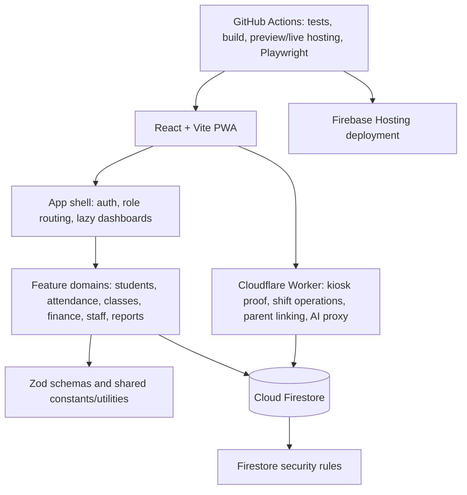

# MYLIBERTY Whole-Portal Baseline Audit

**Audit date:** 2026-10-01  
**Repository revision:** `2a7c7ac` (`main`)  
**Audit basis:** Level 3 Full System Architecture & Scalability procedure, using the Light Regression Check Playbook for representative normal/retry/failure/boundary/state checks.  
**Audit mode:** Read-only. No production code, Firestore rules, configuration, or architecture documentation was changed.

## 1. Executive Summary

The project has a coherent feature-oriented React/Firebase structure, meaningful unit and browser-test coverage, transactional handling for several important workflows, and deliberate code splitting. Local lint, typecheck, production build, the full Vitest suite, Playwright, and the Cloudflare Worker build all pass.

The audit found **four high-priority issues** requiring review before treating the current baseline as production-ready:

- The real Firestore emulator rejects several valid Front Office writes after the rules evaluator reaches its 1,000-expression ceiling.
- The parent portal's class query is denied by the current branch-scoped rules and its repository converts the failure into an empty result.
- Front Office parent unlinking writes a field excluded by Firestore's parent update allowlist, so the parent-child access relationship cannot be revoked through that path.
- The Worker class-switch transition is a sequence of independent writes, not an atomic operation; simultaneous valid requests can create more than one open shift.

There are also important server/client policy mismatches around corporate-event eligibility and kiosk proof fallback, a cash-reconciliation fallback that may silently omit records above 200, and a parent progress-report list rule that does not apply the active-child/branch checks used by direct reads.

**Fitness for current scale:** structurally sound enough for current school operations, but not suitable for an unconditional production-readiness claim while valid rule writes fail in the emulator and parent/kiosk workflows have the gaps below.  
**Growth outlook:** the principal growth risks are historical shift/payment query behavior, the Worker transition race, security-rule evaluation complexity, and incomplete server-side policy checks. No current Firestore prices, data cardinalities, deployment secrets, or production metrics were available, so no cost estimate is asserted.

No Critical-severity defect was proven in this static/local audit. The High findings below include an observed rules-evaluation failure and source-proven workflow/security defects. The audit does not establish that any issue has been exploited in production.

## 2. Architecture Map

The current main-branch workflow deploys the browser app to Firebase Hosting. The Cloudflare Worker is a separately deployed API surface. Browser Firestore requests are governed by `firestore.rules`; Worker operations may use a configured service-account token and therefore require complete server-side validation.

## 3. Architecture Drift

### Documented and accurate

- Domain-centered features and role-level lazy loading are present in `src/features/` and `src/App.jsx`.
- Repository/data-access modules are the preferred Firestore boundary; existing direct-access exceptions are acknowledged in `docs/ARCHITECTURE.md`.
- Class attendance uses deterministic IDs and transaction-based scan idempotency; application approval/enrollment also uses a transaction.
- Firestore rules default-deny unmatched paths, and the rules include separate strict branch checks for list operations.
- The PWA build separates major role/domain bundles and avoids runtime caching of Firestore/API calls.

### Documented but stale

- The Light Regression Check README points to `MyLiberty_Portal_Light_Regression_Check_Playbook.md`, but that file is absent from the playbook folder listing; the seven modular files are present.
- `docs/audits/current/README.md` does not list several later audit documents already in that folder, so it is not a complete current-audit index.
- Some prior findings in the September reports no longer match this source revision: payment recording now accepts an idempotency key; class roster removal and transfer now re-read inside transactions; desk-inquiry callers pass branch filters; kiosk challenge consumption uses Firestore `updateTime` compare-and-set; clock-in checks staff/device branch equality; missing event documents are rejected; and failed initial shift creation attempts to clear its opening lock. These older claims were not carried forward as current findings.

### Implemented but undocumented

- The Worker handles parent-link creation as a privileged server path, while unlinking remains a direct client write. This split ownership is not described as a current parent-link contract in the architecture guide.
- Corporate-event eligibility is calculated in client code, but the Worker does not apply the same audience/date/time policy before recording the shift.

### Contradictory

- The architecture describes parent access to linked child class data under rule enforcement, but the production parent class query omits the branch constraint required by `isSameBranchStrict`; the real emulator test for that query fails.
- Parent direct-read rules use `isParentOf` (including active status and branch checks), while the progress-report list rule checks only parent status and child-ID membership.
- Kiosk code comments describe the Worker proof path as fail-closed, but the scan processor falls back to a direct client shift write when Worker configuration or browser crypto is absent.

### Unverified

- Whether the currently deployed Firebase rules and indexes match this checkout.
- Production Cloudflare secrets, Worker version, allowed-origin configuration, and whether App Check is enabled.
- Real collection sizes, branch traffic, observed read/write rates, and Firestore billing/quotas.
- Whether the advisory code in the `@grpc/grpc-js` dependency path is reachable in the shipped browser bundle or any deployed server runtime.
- Kiosk hardware/browser behavior and concurrent Worker requests against production data.

## 4. Critical Findings

None classified Critical based on the evidence available. This is not a clean bill of health: see the High findings below, especially the emulator-confirmed rules failures and the Worker shift-state race.

## 5. High-Priority Findings

### H-01 — Valid Front Office writes exceed the Firestore rules expression budget

**Severity:** High  
**Likelihood:** High for the tested operations  
**Confidence:** High for observed denial; Medium for exact root cause

**Evidence:** `npm run test:rules` ran 46 emulator tests: 42 passed and 4 failed. Three valid same-branch operations were denied with `PERMISSION_DENIED: Unable to evaluate the expression as the maximum of 1000 expressions to evaluate has been reached`: payment recording batch, mark-payment-pending, and Front Office student status update. Relevant rule paths include `firestore.rules:249`, `firestore.rules:484`, and `firestore.rules:490`; corresponding tests are in `src/features/shared/firestoreRules.emulator.test.js:153` and `src/features/shared/firestoreRules.emulator.test.js:325`.

**Impact:** The tested cashier and student-maintenance operations cannot complete under the local Firestore rules engine. The failure is before successful persistence, so the UI should not be relied on to make these operations available until the rules are simplified and the emulator suite passes.

**Recommendation:** Refactor repeated role/profile/branch evaluation in the affected rule paths and run the exact emulator operations again. Verify deployed rules separately before concluding production is affected or resolved. Do not relax authorization to work around the expression ceiling.

### H-02 — Parent portal class query is denied by branch-list rules

**Severity:** High  
**Likelihood:** High  
**Confidence:** High; observed by the real rules emulator

**Evidence:** `src/features/students/parentPortalRepository.js:79` queries classes by `studentIds` and open status, but does not include `branchId`. The parent branch of `/classes` list authorization requires `isSameBranchStrict` in `firestore.rules:316`. The test explicitly expects this query shape to succeed at `src/features/shared/firestoreRules.emulator.test.js:761`; it fails in the emulator.

**Impact:** The parent dashboard can display no class/schedule data for a linked child. `getChildAttendanceAndClasses()` catches query errors and returns an empty class list, making a permission failure resemble a valid empty result.

**Recommendation:** Pass the authoritative child's canonical branch into the repository query and include it in the list query, or deliberately revise the rule contract with equivalent child-branch enforcement. Keep an emulator test for the exact production query.

### H-03 — Front Office cannot unlink a parent-child relationship

**Severity:** High  
**Likelihood:** High when a Front Office user attempts unlink  
**Confidence:** High from the rule allowlist and repository call

**Evidence:** `src/features/dashboard/usersRepository.js:424`/`:429` updates `childStudentIds` with `arrayRemove`. The Front Office parent-profile update rule only allows `displayName`, `phone`, `updatedAt`, `status`, and `branch` at `firestore.rules:278`; `childStudentIds` is excluded. The Worker exposes a parent-link route but no unlink route (`cloudflare-worker/worker.js:1111` and router near `:1265`). Admin writes bypass this allowlist, but Front Office writes do not.

**Impact:** A Front Office user cannot revoke a parent's access through the unlink action. The relationship remains in the parent profile and can continue authorizing access wherever the rules accept the relationship. Student deletion batches that also update linked parent documents can fail for the same reason when attempted by a non-admin user.

**Recommendation:** Add a server-authoritative unlink operation with actor/branch/student validation and atomic array removal, or a narrowly scoped rules operation that enforces the same invariants. Add an emulator test proving unlink succeeds for the intended role and that subsequent parent reads fail.

### H-04 — Worker class switch is not atomic or safe against concurrent retries

**Severity:** High  
**Likelihood:** Medium; requires overlapping valid requests  
**Confidence:** High for the non-atomic write sequence; runtime race not load-tested

**Evidence:** `handleShiftClassSwitch` reads the prior open shift, writes its `clockOut` using `fsSetDoc`, then creates a new shift separately at `cloudflare-worker/worker.js:1023` and `:1037`. `fsSetDoc` is a plain REST `PATCH` without a document update-time precondition (`cloudflare-worker/worker.js:232`). There is no transaction or conditional transition tying the close and new shift creation together. The compensation write on create failure (`:1065`) is also unconditional.

**Impact:** Two requests with distinct valid nonces can both read the same open shift, close it, and each create a new open shift. A partial failure or uncertain network response can also leave the old/new state inconsistent. This violates the single-open-shift invariant and can corrupt attendance history.

**Recommendation:** Make the prior-shift transition conditional on its observed update time and coordinate the new-shift/active-lock state through an atomic server-side operation or a recoverable state machine. Add concurrent duplicate and failure-injection Worker tests before release.

### H-05 — Worker does not enforce corporate-event audience eligibility

**Severity:** High  
**Likelihood:** Medium; requires a valid kiosk device request selecting an ineligible event  
**Confidence:** High for missing server check; no endpoint-level test suite exists

**Evidence:** Client eligibility checks include active state, event date/time, branch, division, and role in `src/features/attendance/corporateEvents.js:86` and `:131`. The clock-in Worker fetches the selected event and checks only existence and `status === "active"` at `cloudflare-worker/worker.js:685` and `:689`; it then uses the event name at `:692`. The event schema explicitly supports `all`, `branch`, `role`, and `division` scopes.

**Impact:** A modified kiosk client with a valid device signature can select an active event outside the scanned staff member's branch, role, division, or eligibility window. The Worker then persists a shift attributed to that event. Client filtering is not an authorization boundary.

**Recommendation:** Recompute event eligibility in the Worker from the authoritative user/device/event documents and server time, including audience and branch/division/role constraints. Add endpoint tests for every audience type and wrong-context rejection.

## 6. Medium / Low Findings

### M-01 — Kiosk clock-in has a direct-write fallback that bypasses device proof

**Severity:** Medium  
**Likelihood:** Conditional on missing Worker URL or unsupported browser crypto  
**Confidence:** High from source

`executeStaffClockIn` uses the proof endpoint only when both `VITE_AI_WORKER_URL` and Web Crypto are available; otherwise it calls `clockIn()` directly (`src/features/attendance/kioskScanProcessor.js:24`, `:40`, `:42`, and `:56`). The direct Firestore shift rule permits Admin or Front Office creation and validates role/branch, but it does not establish device proof or a server timestamp (`firestore.rules:576`). The normal hardened repository method itself says it fails closed when these prerequisites are absent.

This creates a configuration/browser downgrade path for an authenticated Front Office session: shift identity and timestamp are client-provided and no kiosk signature is verified. Remove the fallback or make it an explicit, separately authorized operating mode with clear audit attribution and tests.

### M-02 — Clock-out does not enforce kiosk/device branch equality

**Severity:** Medium  
**Likelihood:** Low to Medium  
**Confidence:** High from source

Clock-in compares the employee branch with the kiosk device branch at `cloudflare-worker/worker.js:650`, and class switch checks both employee and prior-shift branch at `:1002`. Clock-out verifies only that the shift belongs to the scanned badge at `:892` before writing it (`handleShiftClockOut` begins at `:830`). It does not compare `device.branchId` with the user/shift branch.

A valid active kiosk at another branch can therefore close the same employee's shift if it has the badge and shift identifier. Add the same server-side branch check used by clock-in/class-switch and test a wrong-branch clock-out.

### M-03 — Archived linked students remain readable through progress-report list authorization

**Severity:** Medium  
**Likelihood:** Medium when an archived student retains historical reports  
**Confidence:** Medium; static rule mismatch, not separately emulator-tested

Direct parent reads use `isParentOf`, which checks the child exists, is a student, is same-branch, and is active (`firestore.rules:213` and `:216`). The progress-report list rule instead checks only that the caller is a parent and the report's student ID appears in `childStudentIds` (`firestore.rules:552`). `archiveStudentProfile` marks the student archived but does not remove parent linkage (`src/features/dashboard/usersRepository.js:258` and `:272`).

**Impact:** A parent who retains the archived student's ID may still list progress reports even though the normal parent bundle and direct-read helper treat that child as inactive. Verify this with an emulator query, then apply the same relationship predicate to list reads or explicitly define archival access policy.

### M-04 — Cash reconciliation fallback silently caps results at 200

**Severity:** Medium  
**Likelihood:** Low today; increases with daily transaction volume or missing indexes  
**Confidence:** High from source

`getPaymentsForRecordedDay()` is described as returning all payments for exact daily reconciliation, but its range-query catch path reads at most 200 documents and filters those client-side (`src/features/finance/paymentsRepository.js:94`, `:117`, and `:126`). The fallback has no order or pagination and catches more than index errors.

If a branch/day exceeds 200 matching records, or the fallback query does not include the day's records, the UI can reconcile an incomplete subset without an explicit incomplete status. Avoid a truncating fallback for financial totals; use a paginated query or fail visibly and preserve the reconciliation as blocked.

### M-05 — High-severity gRPC advisories exist in the runtime dependency graph

**Severity:** Medium pending reachability review  
**Likelihood:** Unverified  
**Confidence:** High that the dependency is present; low that affected server code is shipped/executable

`npm audit --omit=dev --audit-level=high` reports four high-severity advisories for `@grpc/grpc-js`. `npm ls` shows `firebase@12.19.0 > @firebase/firestore@4.17.2 > @grpc/grpc-js@1.9.16`. The advisory concerns gRPC server behavior; the production Vite build did not establish that this server-only path is included or executable in the browser.

Review the compatible dependency path and bundle/runtime reachability. Do not use the audit tool's suggested forced Firebase downgrade without compatibility testing.

### M-06 — Parent progress-report list access is broader than other parent data access

This overlaps M-03 and should be verified with an emulator query. `/classAttendance` and `/payments` use `isParentOf` for parent access; `/progressReports` list access uses raw linkage membership. Apply one shared authorization contract so list/get semantics agree.

## 7. Missing Links

- **Parent lifecycle:** Front Office can create a parent link through the Worker, but unlink uses a forbidden direct Firestore update. The access-revocation step is missing for the Front Office workflow.
- **Parent class display:** Parent repository query shape lacks the branch field required by rules; repository converts denial into empty classes.
- **Corporate-event attendance:** client audience selection reaches a Worker that does not independently validate the same audience/time policy.
- **Kiosk shift transition:** close-old/create-new/replace-lock are separate writes, so there is no atomic handoff under concurrency or partial failure.
- **Payment reconciliation:** range-query failure transitions to a capped, potentially incomplete fallback without communicating incompleteness.

## 8. Data Model Assessment

- **Users:** identity and current profile state live in `/users/{uid}`. Parent-to-child IDs are stored in `childStudentIds`; the array is expected to remain small but has no explicit size bound.
- **Classes:** class membership uses `studentIds` and richer `enrollments` arrays. Capacity checks exist in repositories/rules; these are bounded by class capacity in intended use. Transactions are used for core add/remove/transfer paths.
- **Attendance:** class attendance is a separate historical collection with deterministic `{classId}_{studentId}_{attendanceDate}` IDs. Scans use transactions and preserve manual corrections. Parent history is limited to 30 records; per-class live listeners are scoped to class/date.
- **Shifts:** append-style history lives in `/shifts`, with an `activeShifts` lock used by the Worker. Normal reports request a date window, while open-shift queries are separate. Worker class-switch still lacks atomic state transition.
- **Payments:** transactions are separate documents; student payment summary fields are denormalized and updated in the same batch. Idempotency is supported for a stable key within a payment operation. Daily reconciliation fallback can truncate.
- **Operational logs:** `errorLogs` is growth-sensitive but includes a 38-day retention helper, 500-document batches, and a per-invocation cap of 5,000 deletes. This is bounded operationally, but retention execution/monitoring in production was not verified.
- **Indexes:** indexes are explicitly listed for major branch/date/role query shapes; deployed index state was not verified.

## 9. Security Assessment

- Authentication uses Firebase Auth; Firestore rules derive role and branch from the user profile rather than trusting UI state for protected access.
- The rules distinguish get/list branch behavior and include a default deny. Parent direct reads check linkage, active status, student role, and branch.
- Worker endpoints that use a service-account token bypass Firestore rules by design, so endpoint validation is authoritative. The event audience omission and class-switch race are material because they occur on that privileged path.
- The parent unlink path is denied by rules, and the progress-report list rule does not reuse the full parent predicate.
- Kiosk clock-out lacks device branch binding, and the direct clock-in fallback weakens device-proof/server-time guarantees when configuration or browser support is absent.
- `.env`, `.env.local`, and `serviceAccountKey.json` exist in the workspace but are ignored by `.gitignore` and are not tracked. Their contents were not opened. This confirms repository tracking hygiene for these paths, not secret rotation or remote-history status.
- No live production Firestore or Worker request was made.

## 10. Scalability Assessment

| Subsystem | Current Design | Growth Risk | Bottleneck | Recommended Direction |
|---|---|---|---|---|
| Front Office Firestore writes | Profile-derived role/branch helpers and allowlists | Rule expression work can fail before data volume matters | 1,000-expression ceiling observed in emulator | Simplify repeated helper evaluations; keep real rule tests mandatory |
| Parent portal | One read per linked child; classes limited to 20; attendance limited to 30 | Sequential child reads scale with number of linked children | Current class query denied; N+1 latency if linkage grows | Fix query authorization first; consider parallel/batched child reads if family sizes materially grow |
| Attendance | Deterministic per-session records; bounded class listeners | Historical collection grows continuously | Reporting queries/indexes and hot session rosters at peaks | Keep date windows and measure peak check-in behavior |
| Staff shifts | Historical documents plus active-shift state; reports normally use date windows | Historical growth and concurrent transitions | Worker sequential writes and concurrent class-switch race | Conditional state transitions and load/failure-injection tests |
| Payments | Per-payment documents and daily range query | Daily reconciliation grows with transactions | 200-document fallback can undercount; index outage | Paginate exact day query or fail visibly; monitor index health |
| Corporate events | Ordered query/listener capped at 100; kiosk reads date/status | Low expected growth; all staff can read records | Audience authorization is client-only for Worker operation | Enforce authoritative event scope in Worker; keep bounded queries |
| Error logs | Deduplication, 38-day cleanup, max 5,000 deletes per invocation | Growth can outpace a single cleanup run | Whether cleanup is regularly triggered is unverified | Monitor count/hasMore and alert on backlog |
| Frontend bundles/PWA | Lazy role/domain chunks; 62 precache entries (~3.46 MiB) | Initial install/download cost grows with precache set | First install/offline cache size, not a current compile failure | Monitor install time on kiosk/tablet devices; retain role lazy loading |

Scale assessment: at 10–100 users, bounded date/class queries and school-sized user/class collections appear appropriate. At 1,000 users, shifts/attendance and broad administrative reports need measured read volumes and pagination review. At 10,000 users or 10×–100× historical records, collection scans, array-based shared state, Worker request concurrency, and log retention need explicit redesign/load evidence. These are directional assessments, not billing estimates.

## 11. Failure Mode Assessment

- **Rules evaluator limit:** valid Front Office writes fail with permission-denied from expression exhaustion in the emulator.
- **Parent query denial:** class read errors are caught and converted to empty data; the interface can appear empty rather than showing a permission failure.
- **Worker unavailable:** the hardened direct Worker methods return an error; however, a separate caller path falls back to client clock-in if Worker URL/crypto prerequisites are absent.
- **Partial class switch:** compensation tries to reopen the prior shift if creating the next shift fails, but writes are not conditional and recovery may race.
- **Payment range-query failure:** catch path falls back to an unpaginated 200-document sample, which can be incomplete.
- **Error reporting:** reporting is fail-safe and deduplicates by in-memory key, but the dedupe state is per browser process and telemetry persistence/retention behavior in production was not verified.
- **Legacy documents:** some branchless records retain a Kota Gorontalo fallback for get/update; list checks are stricter. This is intentional compatibility behavior but should remain covered by rule tests.

## 12. Testing Gaps

### Verification run

| Check | Result |
|---|---|
| `npm test` | PASS — 76 test files passed, 1 skipped; 1,007 tests passed, 46 skipped |
| `npm run test:e2e` | PASS — 21 Playwright tests passed |
| `npm run lint` | PASS |
| `npm run typecheck` | PASS |
| `npm run build` | PASS — Vite production build and PWA generation completed |
| `npm run build --prefix cloudflare-worker` | PASS |
| `node --check cloudflare-worker/worker.js` | PASS |
| `npm run test:rules` | FAIL — 42 passed, 4 failed; three expression-budget denials and the parent class-query denial |
| `npm audit --omit=dev --audit-level=high` | FAIL — four high-severity advisories reported for `@grpc/grpc-js` dependency paths |
| `npm run knip` | FAIL/warnings — unused file/exports, an unused-dependency warning, and unlisted Firebase CLI binary; several barrel exports may be intentional |
| `npm run format:check` | FAIL — 219 files reported as not formatted |

### Coverage gaps

- `npm test` runs without the emulator and skips the 46 real-rule tests. The GitHub Hosting workflows run `npm test` and build; they do not start the Firestore emulator, and they do not run lint or typecheck. A separate workflow runs Playwright.
- The Worker folder has no first-party endpoint/concurrency test suite. This leaves service-account-backed authorization and shift state transitions without automated contract coverage.
- Add emulator tests for parent unlink, archived-child report list denial, event audience authorization where Firestore is involved, and the exact parent class query. Add Worker tests for wrong branch, event audience, concurrent class-switch, duplicate clock-out, and partial failures.
- Current browser tests passed but do not establish authenticated production behavior, real kiosk hardware behavior, production rules deployment, or load behavior.

## 13. Technical Debt

- Broad formatting drift is present across 219 files; the repository's current checks do not gate formatting in CI. Avoid a mass-format pass during remediation because it would obscure the behavioral fixes.
- Knip reports one unused file (`src/features/dashboard/kids/index.js`), 59 unused exports, duplicate exports, `firebase-admin` as an unused dev dependency, and the Firebase CLI as an unlisted binary. Review these individually; public feature barrels and maintenance scripts can be intentional.
- The Firebase CLI is required by `test:rules` but is not listed as a root dependency, making clean-environment emulator execution dependent on external setup.
- `docs/audits/current/README.md` and the Light Regression README file reference need index maintenance, but this is documentation hygiene rather than an immediate runtime risk.
- The `@grpc/grpc-js` audit finding needs reachability analysis; do not equate package-tree presence with an exploitable browser path.

## 14. Recommended Roadmap

### Fix Now

1. Reduce Firestore rule evaluation complexity until the valid payment and student-update emulator tests pass.
2. Correct the parent class query/rules contract and ensure permission failures are surfaced rather than rendered as empty data.
3. Implement a validated parent unlink path and verify it actually removes access; include linked-student deletion behavior.
4. Make Worker class-switch conditional/atomic and validate corporate-event audience/date/time on the server.
5. Remove or explicitly gate the direct clock-in downgrade, and require clock-out device/user/shift branch agreement.

### Fix Before Significant Growth

1. Replace the 200-record cash-reconciliation fallback with pagination or explicit blocked/error behavior.
2. Align parent progress-report list authorization with `isParentOf` and confirm archive access policy.
3. Make the real Firestore emulator suite reproducible in CI and require it before deployment; add Worker endpoint tests.
4. Resolve or document the `@grpc/grpc-js` advisory path after verifying browser/server reachability and compatible upgrades.
5. Add observability for retention backlog, Worker failure/latency, shift transition conflicts, and query volume.

### Monitor

- Daily payment counts and reconciliation fallback usage.
- Shift/attendance growth, report query result sizes, and indexes.
- Error-log retention `hasMore` frequency.
- PWA first-install time and cache size on kiosk devices.
- Production Worker version, secret configuration, and deployed Firebase rules/index revisions.

### Do Not Change Yet

- Keep the domain-centered structure and lazy dashboard loading.
- Keep deterministic class-attendance IDs, transaction-based scan idempotency, and the parent/student entity separation.
- Do not mass-format or broadly refactor documented direct-Firestore exceptions as part of these targeted fixes.
- Do not downgrade Firebase using `npm audit fix --force` without a separate compatibility plan.

### Required Architectural Questions

1. **Could architecture cause data corruption or security failure?** Yes: current Worker event eligibility and parent authorization mismatches, the class-switch race, and the parent unlink denial create integrity/access risks; valid rules writes also fail in the emulator.
2. **Is there a missing business/data link?** Yes: Front Office parent unlink is not wired to an authorized server path; the parent class query is incompatible with its rule boundary.
3. **First bottleneck under heavy traffic?** The Worker class-switch sequence and rules-expression ceiling are the first demonstrated constraints; kiosk bursts should be load-tested for lock contention and retries.
4. **First bottleneck as the database grows?** Historical shifts/attendance and any reports that lose their date bounds; cash reconciliation's 200-record fallback becomes incorrect before it becomes a performance solution.
5. **Safe now but risky at 10×?** School-sized collection reads, the parent linkage array, per-instance in-memory deduplication, and high-volume shift transitions.
6. **What must be fixed before more features?** Rules evaluator failures, parent access lifecycle/query contract, and authoritative Worker validation/state transitions.
7. **What can remain technical debt?** Formatting drift, intentional barrel exports, and documented direct-access exceptions that are stable and bounded.
8. **What should be load-tested?** Concurrent kiosk clock-in/class-switch/clock-out; event check-in bursts; report queries over growing history; rules writes under representative batch workflows.
9. **What assumptions remain unverified?** Deployed rules/indexes, production Worker secrets/version, live record counts, Firebase pricing/usage, and advisory reachability in shipped runtime.
10. **Does `docs/ARCHITECTURE.md` describe reality?** Mostly, but it does not fully capture the Worker/client event-policy boundary and parent list/get authorization mismatch; this report records those discrepancies without editing the protected architecture guide.
11. **What changes should be documented after approval?** The final parent-link ownership/revocation contract, server-authoritative corporate-event eligibility, and atomic kiosk shift-state transition.
12. **Smallest practical readiness roadmap?** Fix the emulator failures and parent access lifecycle, harden Worker policy/state transitions with endpoint tests, then add CI gates and verify the financial fallback and dependency advisory.
