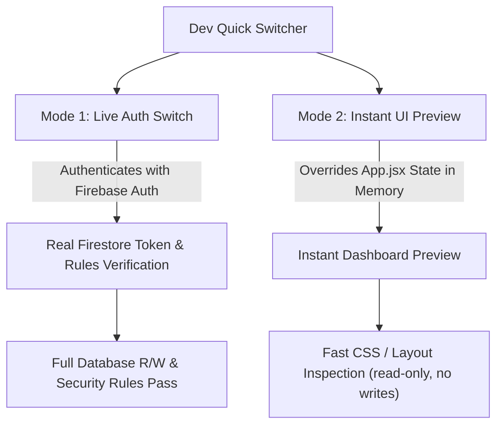

# Specification: Hybrid Quick Switch User & Role Tester

**Document Status:** Proposal / Plan for Review  
**Target File:** `docs/plans/hybrid-quick-switch-user-spec.md`  
**Author:** AI Pair Programmer (Antigravity)  
**Audience:** Kifry (MyLiberty Portal Administrator & Lead)  
**Date:** 2026-09-27  
**Revision:** 2 — Tightened after cross-referencing with current `App.jsx` and architecture review.

---

## 1. Problem & Context

In MyLiberty Portal, testing the application requires inspecting multiple distinct operational roles:
- **Admin** (Superadmin overview, company-wide settings, user approvals)
- **Manager** (Branch performance, staff management, payroll review — English Studio & Kindergarten)
- **Instructor / Instructor Leader** (Class logs, student grading, agenda, attendance)
- **Front Office / Ops Lead / Front Office Lead** (Student registrations, payments, daily receipting, attendance kiosk)
- **Marketing** (Leads, campaigns, prospect follow-ups)
- **Office Boy** (Facility maintenance, daily checklist)

Currently, testing each dashboard requires logging out, typing credentials for each account, and logging back in. Furthermore, testing **Firestore Security Rules** requires genuine Firebase Auth tokens matching the corresponding document in `/users/{uid}`.

---

## 2. The Hybrid Solution

To satisfy both **rapid layout inspection** and **live security rule verification**, we propose a **Hybrid Switcher**:



### Mode 1: Authentic Firebase Auth Switch (Verifies Rules & Data)
- **What it does:** Executes `signInWithEmailAndPassword` using dedicated test accounts for each role. Uses the existing `handleLogin(email, password)` flow in `App.jsx` — **no parallel auth path**.
- **Why it matters:** Firebase evaluates security rules on the server (`request.auth.uid` against `/users/$(request.auth.uid)`). Authentic login proves that rules like `isStaff()`, `isAdmin()`, `isSameBranch()`, and batch limits function correctly.
- **Where it appears:** 
  1. Quick-login tiles directly on the **LoginPage** (calls `onLogin` prop).
  2. One-click switch inside the **Dev Floating Widget** while logged in (triggers `signOut` → `signInWithEmailAndPassword` via the same `handleLogin` flow).
- **Division switching in Mode 1:** Division is determined by the test account's Firestore `/users/{uid}` document. To test Kindergarten dashboards, use a separate Kindergarten test account (e.g., `manager-tk.test@myliberty.id`). Do not override division client-side in Mode 1 — that would produce mismatched data.

### Mode 2: Instant UI Preview (Zero Network Latency)
- **What it does:** Overrides `role` and `division` in local React state (`App.jsx`) to load a different dashboard component instantly. The underlying Firebase Auth session and Firestore data remain unchanged.
- **Visual Warning Banner:** Shows a sticky top banner:  
  `"⚠️ UI Preview Mode: [Instructor - English Studio] — Layout only. Data & writes belong to your real session."`
- **Use case:** Quick visual check of dashboard layout, menu navigation, responsive behavior, button placement, CSS tweaks. **Not for testing data correctness or Firestore rules** — use Mode 1 for that.

#### Mode 2 Write Protection

Because `auth.currentUser` remains the real user during Mode 2, any Firestore reads/writes would use the real user's UID and permissions. This creates two risks:

1. **Wrong data displayed** — the instructor dashboard fetches data for the real user's UID, which may be an admin account.
2. **Accidental writes** — submitting a form writes as the real user, not the previewed role.

**Mitigation (required):**
- When `previewRole` is active, set a global flag (e.g., `isPreviewMode`) accessible via context or module-level export.
- All **write/submit buttons** in dashboard components should check this flag and be **disabled** when preview mode is active, with a tooltip: `"Disabled in preview mode"`.
- The preview warning banner should include a prominent **"Exit Preview"** button that clears the override.
- Data displayed may be inconsistent — this is expected and acceptable for layout inspection purposes.

---

## 3. UI/UX Placement

### A. On the Login Screen (`LoginPage.jsx`)
Below the login form (visible only in Dev mode or when enabled), a collapsible panel:
> **⚡ Quick Test Accounts (Dev Mode)**  
> `[ Admin ]` `[ Manager ]` `[ Manager·TK ]` `[ Instructor ]` `[ Front Office ]` `[ Marketing ]` `[ Office Boy ]`  
> *Clicking any button calls `onLogin(email, password)` — the same prop already used by the login form.*

### B. Floating Pill on Inside Pages (`DevQuickSwitcher.jsx`)
- Positioned discreetly in the bottom-right corner (`z-50`).
- Collapsed by default into a small badge (`⚡ Dev Switcher`).
- When clicked, expands into a sleek card with:
  1. **Current Active User & Role badge** — shows the real authenticated user and their Firestore role.
  2. **Switch Real Account** (Mode 1 — triggers genuine Firebase Auth re-login).
     - Role buttons: Admin, Manager, Manager·TK, Instructor, Instructor Leader, Front Office, Ops Lead, Marketing, Office Boy.
  3. **Preview UI As...** (Mode 2 — instant in-memory preview).
     - Role picker with all dashboard-routable roles (see Section 5).
     - Division toggle (`English Studio` ↔ `Kindergarten`).
  4. **Branch indicator** (read-only) — displays the current user's `branchId` from their Firestore document. **Not switchable** — branch is determined by the user's data, not a client-side toggle. Switching branches requires Mode 1 with a test account assigned to that branch.

---

## 4. Security & Environment Protection

To ensure production safety and prevent unauthorized privilege escalation:

1. **Environment Guard:**
   ```javascript
   const isDevSwitcherEnabled = 
     import.meta.env.DEV || 
     import.meta.env.VITE_ENABLE_DEV_SWITCHER === "true";
   ```
2. **Production Tree-Shaking:**
   If `isDevSwitcherEnabled` is false (default in production builds without the env flag), the component returns `null` and test credentials are never bundled.
3. **No Secret Leaks:**
   All test accounts share a single password stored in one environment variable:
   ```env
   VITE_DEV_TEST_PASSWORD=<shared-test-password>
   ```
   This variable is only set in `.env.local` (gitignored). Real production admin passwords are never hard-coded or referenced.
4. **Preview Mode Safety:**
   Mode 2 sets a `isPreviewMode` flag. Components should disable write operations when this flag is true. The flag is cleared on page refresh or explicit exit.

---

## 5. Role Coverage

### All dashboard-routable roles

The following roles are currently handled by the dashboard router in `App.jsx` and must be supported by both modes:

| Role Key | Dashboard Component | Division Variant |
| :--- | :--- | :--- |
| `admin` | `AdminDashboard` | — |
| `manager` | `ManagerDashboard` | Studio |
| `manager` | `KidsManagerDashboard` | Kindergarten |
| `instructor` | `InstructorDashboard` | Studio |
| `instructor` | `KidsInstructorDashboard` | Kindergarten |
| `instructorleader` / `instructor_leader` | `InstructorDashboard` (with `role` prop) | Studio |
| `instructorleader` / `instructor_leader` | `KidsInstructorDashboard` | Kindergarten |
| `frontoffice` | `FrontOfficeDashboard` | Studio |
| `frontoffice` | `KidsFrontOfficeDashboard` | Kindergarten |
| `opslead` / `ops_lead` / `frontofficelead` | `FrontOfficeDashboard` (with `role` prop) | Studio |
| `opslead` / `ops_lead` / `frontofficelead` | `KidsFrontOfficeDashboard` | Kindergarten |
| `marketing` | `MarketingDashboard` | — |
| `officeboy` | `OfficeBoyDashboard` | — |

### Mode 2 role picker

The Mode 2 preview should offer a simplified picker using canonical role labels:
- Admin
- Manager
- Instructor
- Instructor Leader
- Front Office
- Ops Lead
- Marketing
- Office Boy

With a separate **Division toggle** (`English Studio` ↔ `Kindergarten`) that affects which dashboard variant loads.

---

## 6. Required Test Accounts in Firebase / Firestore

For Mode 1 (Authentic Auth Switch) to pass Firestore rules, the following test accounts should exist in Firebase Auth with matching `/users/{uid}` documents:

| Role | Test Email | Firestore `role` | Firestore `division` | Default Branch |
| :--- | :--- | :--- | :--- | :--- |
| **Admin** | `admin.test@myliberty.id` | `admin` | `studio` | `kota_gorontalo` |
| **Manager** | `manager.test@myliberty.id` | `manager` | `studio` | `kota_gorontalo` |
| **Manager · TK** | `manager-tk.test@myliberty.id` | `manager` | `kindergarten` | `kota_gorontalo` |
| **Instructor** | `instructor.test@myliberty.id` | `instructor` | `studio` | `kota_gorontalo` |
| **Instructor Leader** | `instructorleader.test@myliberty.id` | `instructorleader` | `studio` | `kota_gorontalo` |
| **Front Office** | `frontoffice.test@myliberty.id` | `frontoffice` | `studio` | `kota_gorontalo` |
| **Marketing** | `marketing.test@myliberty.id` | `marketing` | `studio` | `kota_gorontalo` |
| **Office Boy** | `officeboy.test@myliberty.id` | `officeboy` | `studio` | `kota_gorontalo` |

**Password:** All test accounts use the same password, stored in `VITE_DEV_TEST_PASSWORD` in `.env.local`.

*(Note: If these accounts do not yet exist in Firebase Authentication, Mode 2 UI Preview works immediately. A seed script or manual setup instructions for Mode 1 can be provided separately.)*

---

## 7. Files to Create & Modify

1. **New File:** `src/features/shared/DevQuickSwitcher.jsx`
   - Floating widget with accordion / popover.
   - Handles both Mode 1 (Auth Sign-In via existing `handleLogin`) and Mode 2 (Preview Override).
   - Exports/sets `isPreviewMode` flag for write protection.
2. **New File:** `src/features/auth/devPresets.js`
   - List of all test roles (see Section 5), labels, canonical role keys, divisions, and test account emails.
   - Reads `VITE_DEV_TEST_PASSWORD` for Mode 1 credentials.
3. **Modify File:** `src/App.jsx`
   - Add `previewRole` and `previewDivision` state (only used when `isDevSwitcherEnabled`).
   - Dashboard router uses `previewRole ?? role` and `previewDivision ?? division` for component selection.
   - Render `DevQuickSwitcher` when enabled (pass `handleLogin`, current role/division, preview setters).
   - Render preview warning banner when `previewRole` is active.
4. **Modify File:** `src/features/auth/LoginPage.jsx`
   - Add optional quick-login tiles for dev mode below the login form.
   - Tiles call the existing `onLogin(email, password)` prop — no separate auth flow.

---

## 8. Cost & Performance Assessment
- **Financial Cost:** $0. Uses existing Firebase Free Tier (Spark Plan).
- **Firestore Reads:** 0 extra reads for Mode 2 (in-memory). Standard 1 user document read on sign-in for Mode 1.
- **Dependencies:** 0 new dependencies. Built with existing Tailwind CSS and `lucide-react`.
- **Bundle Impact:** `DevQuickSwitcher` and `devPresets` are only imported when `isDevSwitcherEnabled` is true. In production builds without the env flag, Vite's tree-shaking eliminates them entirely.

---

## 9. Verification Plan
1. **Local Build & Lint:** Run `npm run lint` and `npm run build` to verify no syntax or module errors.
2. **Mode 2 Verification:** Click each role in the UI preview; ensure the correct dashboard chunk loads. Verify write buttons are disabled with tooltip.
3. **Mode 1 Verification:** Click a test account; verify Firebase Auth updates, Firestore snapshot attaches, and proper branch data is retrieved.
4. **Division Verification (Mode 1):** Switch to `manager-tk.test@myliberty.id`; verify `KidsManagerDashboard` loads with Kindergarten data.
5. **Division Verification (Mode 2):** Toggle division to Kindergarten while previewing Manager; verify `KidsManagerDashboard` layout loads (data may be inconsistent — expected).
6. **Security Verification:** Build production bundle with `VITE_ENABLE_DEV_SWITCHER` unset and confirm widget is completely absent from the bundle.
7. **Write Protection Verification:** In Mode 2, attempt a form submission; confirm it is blocked with a "Disabled in preview mode" indicator.

---

## 10. What This Spec Does NOT Cover

- **Test account seed script** — creating the Firebase Auth users and Firestore documents. Can be a follow-up task.
- **Multi-branch test accounts** — only `kota_gorontalo` branch is covered. Test accounts for other branches can be added later if needed.
- **E2E tests for the switcher itself** — the switcher is a dev tool; manual verification is sufficient initially.
