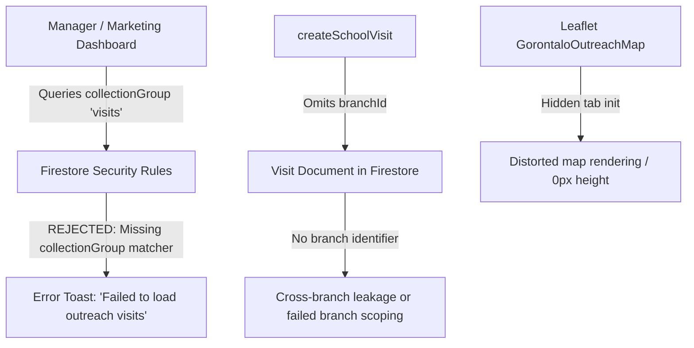

# Remediation Plan: School Outreach Module (Manager & Marketing Dashboards)

**Document Status:** Proposal / Remediation Plan  
**Target File:** `docs/plans/outreach-manager-marketing-remediation-plan.md`  
**Author:** AI Pair Programmer (Antigravity)  
**Audience:** Kifry (MyLiberty Portal Administrator & Lead)  
**Date:** 2026-09-27  

---

## 1. Executive Summary & Problem Diagnosis

The **School Outreach & Visits** module allows Marketing officers to log school visits, track contacts, and view target schools in Kota Gorontalo on an interactive Leaflet map. Meanwhile, Branch Managers track weekly outreach KPIs (visits, flyers distributed, leads generated) and follow-up schedules in `ManagerDashboard`.

However, testing and architectural auditing revealed four critical issues breaking the outreach module on both the Manager and Marketing dashboards:



### Root Cause 1: Missing Collection Group Rule in `firestore.rules` (Critical Hard Error)
In [`ManagerDashboard.jsx`](file:///e:/myliberty-portal/src/features/dashboard/ManagerDashboard.jsx), the dashboard streams visits using:
```javascript
listenToOutreachVisits({ startDate, orderDirection: "desc", limitCount: 200 })
```
which executes `collectionGroup(db, "visits")`.
In [`firestore.rules`](file:///e:/myliberty-portal/firestore.rules#L471-L483), the rule for visits is nested strictly inside `/schoolOutreach/{schoolId}/visits/{visitId}`:
```rules
match /schoolOutreach/{schoolId} {
  match /visits/{visitId} { ... }
}
```
In Firestore, nested rules **never match collection group queries**. A collection group query requires a wildcard path matcher:
```rules
match /{path=**}/visits/{visitId} { ... }
```
Because this rule is missing, **every call to `listenToOutreachVisits` fails with `permission-denied`**, causing the error toasts on the Manager dashboard: `"Failed to load outreach visits: Missing or insufficient permissions"`.

---

### Root Cause 2: Missing `branchId` on Visit Documents (Breaks Branch Isolation)
Per [`docs/ARCHITECTURE.md`](file:///e:/myliberty-portal/docs/ARCHITECTURE.md), MyLiberty enforces multi-branch data isolation (`kota_gorontalo`, `bone_bolango`, etc.):
- When [`createSchoolVisit`](file:///e:/myliberty-portal/src/features/dashboard/marketing/schoolOutreachRepository.js#L327-L377) writes a visit subdocument, it saves `schoolId`, `visitDate`, `contactName`, etc., but **omits `branchId` and `branch`**.
- As a result:
  1. A collection group query cannot enforce `where("branchId", "==", managerBranchId)`.
  2. Firestore security rules cannot verify whether a visit belongs to the user's branch without doing an expensive `get()` lookup on the parent school.
  3. A manager at Bone Bolango or Limboto would either see Kota Gorontalo's visits or crash with rule denial.

---

### Root Cause 3: Seed Script Omits Branch Metadata
In [`seedInitialSchoolsIfEmpty`](file:///e:/myliberty-portal/src/features/dashboard/marketing/schoolOutreachRepository.js#L386-L415), starter schools from `KOTA_GORONTALO_SEEDS` are written with `municipality: "Kota Gorontalo"`, but without `branchId: "kota_gorontalo"` or `branch: "Kota Gorontalo"`.
- If an operational query filters by `where("branchId", "==", "kota_gorontalo")`, seeded schools are excluded.
- Under strict branch security rules (`isSameBranch(resource.data)`), un-branched school documents cause evaluation failures for non-admin branch staff.

---

### Root Cause 4: Leaflet Map Container Tab Rendering
In [`SchoolOutreachTab.jsx`](file:///e:/myliberty-portal/src/features/dashboard/marketing/SchoolOutreachTab.jsx) and [`GorontaloOutreachMap.jsx`](file:///e:/myliberty-portal/src/features/dashboard/marketing/GorontaloOutreachMap.jsx):
- Leaflet requires an active DOM element with computed dimensions to properly lay out map tiles.
- Because `MarketingDashboard` uses tabs (`overview`, `visits`, `inquiries`, `directives`), switching to the "School Visits & Map" tab after initial load can render blank or partial tiles until the window is manually resized.

---

## 2. Proposed Architecture & Remediation Actions

### Action 1: Add Collection Group Security Rule in `firestore.rules`
Add a dedicated collection group matcher for `visits` in `firestore.rules` supporting least-privilege role access and branch isolation:
```rules
match /{path=**}/visits/{visitId} {
  // Collection group read access for Admin, Manager, and Marketing
  allow read: if isAdmin()
    || ((isManager() || hasRole('marketing')) && isSameBranch(resource.data));
  
  allow create: if (isAdmin() || ((isManager() || hasRole('marketing')) && isSameBranch(request.resource.data)))
    && request.resource.data.visitDate is string
    && request.resource.data.contactName is string
    && request.resource.data.contactRole is string
    && request.resource.data.branchId is string;

  allow update, delete: if isAdmin();
}
```

### Action 2: Inherit `branchId` & `branch` on Visits
Update [`createSchoolVisit`](file:///e:/myliberty-portal/src/features/dashboard/marketing/schoolOutreachRepository.js#L327):
1. Read the parent school's `branchId` and `branch` (or fetch from `schoolOutreach/{schoolId}` if not already in memory).
2. Store `branchId` and `branch` directly on the visit document:
   ```javascript
   branchId: parentSchool.branchId || "kota_gorontalo",
   branch: parentSchool.branch || "Kota Gorontalo",
   ```
3. Update [`schoolVisitSchema`](file:///e:/myliberty-portal/src/schemas/schoolOutreachSchema.js) to accept optional `branchId` and `branch`.

### Action 3: Add `branchId` to Seed Records
Update [`seedInitialSchoolsIfEmpty`](file:///e:/myliberty-portal/src/features/dashboard/marketing/schoolOutreachRepository.js#L386):
- Ensure every seeded school includes `branchId: "kota_gorontalo"` and `branch: "Kota Gorontalo"`.

### Action 4: Branch Scoping in `listenToOutreachVisits`
Update [`listenToOutreachVisits`](file:///e:/myliberty-portal/src/features/dashboard/marketing/schoolOutreachRepository.js#L171):
- Add `branchId` to `OutreachVisitOptions`.
- If `options.branchId` is passed (e.g. from `ManagerDashboard`), add constraint:
  ```javascript
  if (opts.branchId && opts.branchId !== "all") {
    constraints.push(where("branchId", "==", opts.branchId));
  }
  ```
- Add composite index to `firestore.indexes.json` for collection group `visits`:
  - `source` ASC + `branchId` ASC + `visitDate` DESC.

### Action 5: Leaflet Invalidation on Tab Switch
In [`GorontaloOutreachMap.jsx`](file:///e:/myliberty-portal/src/features/dashboard/marketing/GorontaloOutreachMap.jsx):
- Add a `ResizeObserver` or `map.invalidateSize()` call with a tiny delay when the component mounts or becomes visible so Leaflet fills its container cleanly.

---

## 3. Files to Modify

| File | Change Scope |
| :--- | :--- |
| [`firestore.rules`](file:///e:/myliberty-portal/firestore.rules) | Add `match /{path=**}/visits/{visitId}` collection group rule with `isSameBranch` checks. |
| [`firestore.indexes.json`](file:///e:/myliberty-portal/firestore.indexes.json) | Add composite index for collectionGroup `visits` (`source` + `branchId` + `visitDate`). |
| [`src/schemas/schoolOutreachSchema.js`](file:///e:/myliberty-portal/src/schemas/schoolOutreachSchema.js) | Include `branchId` and `branch` in `schoolVisitSchema`. |
| [`src/features/dashboard/marketing/schoolOutreachRepository.js`](file:///e:/myliberty-portal/src/features/dashboard/marketing/schoolOutreachRepository.js) | Write `branchId` to visit docs in `createSchoolVisit`, add `branchId` to seed data, add `branchId` filter in `listenToOutreachVisits`. |
| [`src/features/dashboard/ManagerDashboard.jsx`](file:///e:/myliberty-portal/src/features/dashboard/ManagerDashboard.jsx) | Pass `branchId: managerBranchId` to `listenToOutreachVisits` so Manager only queries their branch. |
| [`src/features/dashboard/marketing/GorontaloOutreachMap.jsx`](file:///e:/myliberty-portal/src/features/dashboard/marketing/GorontaloOutreachMap.jsx) | Add `map.invalidateSize()` on mount to eliminate blank tile glitches. |
| [`src/features/dashboard/marketing/schoolOutreachRepository.test.js`](file:///e:/myliberty-portal/src/features/dashboard/marketing/schoolOutreachRepository.test.js) | Add unit tests covering visit creation with `branchId` and query filtering. |

---

## 4. Cost & Performance Assessment

- **Cost Impact:** $0 (Free Tier / Spark Plan safe).
- **Firestore Reads:** 
  - Rolling 90-day window (`limit: 200`) and weekly window (`limit: 500`) prevent unbounded collection scans.
  - Adding `branchId` equality filter reduces read volume by narrowing results to only the relevant branch.
- **Rules Performance:** Collection group rule evaluates local document fields (`resource.data.branchId == userBranch()`) without needing recursive `get()` calls, keeping rule execution fast and cheap.

---

## 5. Verification Plan

1. **Unit & Repository Tests:**
   Run `npm test` to verify `schoolOutreachRepository.test.js` passes with `branchId` assertions.
2. **Typecheck & Linter:**
   Run `npm run typecheck` and verify no broken imports or type mismatches.
3. **Emulator / Security Rules Verification:**
   Verify `collectionGroup("visits")` queries succeed for Admin, Manager, and Marketing roles, while properly isolated by branch.
4. **UI Manual Verification:**
   - In **Manager Dashboard**: Check that Outreach tab loads without toast errors; verify weekly metrics calculate correctly.
   - In **Marketing Dashboard**: Check that Map tab opens, pins display, Leaflet tiles render completely, and "Log Visit" saves with `branchId`.
