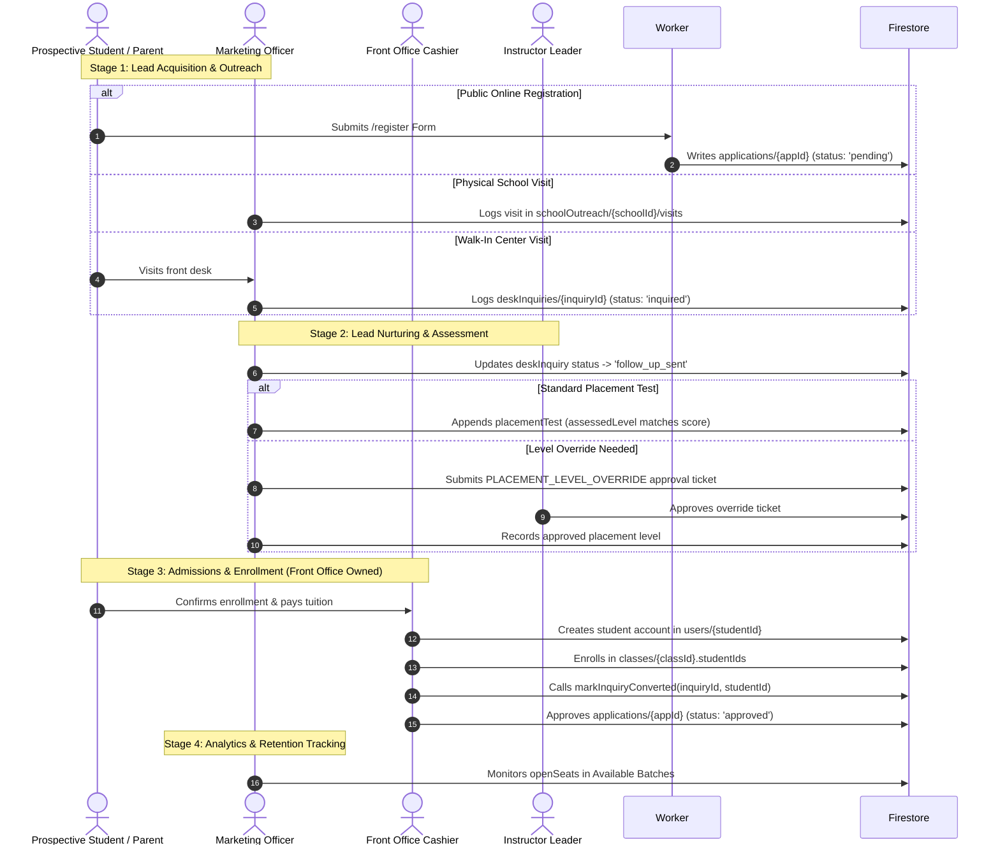

# Marketing Dashboard: Phase 0 Conformance Audit & Architecture Map

> **Document Type:** Phase 0 Architecture, Governance & Security Conformance Audit  
> **Target Dashboard:** Marketing Dashboard (`src/features/dashboard/MarketingDashboard.jsx`)  
> **Audited By:** Coding / Executor Agent  
> **Date:** 2026-10-09  
> **Governing Baseline:** Authoritative Blueprint v3.3 (Approved by Owner Kifry 2026-10-07)  
> **Execution Baseline:** `docs/audit-prompts/2026-10-09-marketing-dashboard-phase0-brief.md` + `docs/audit-prompts/2026-10-09-marketing-dashboard-phase0-amendments.md`  
> **Companion Document:** [`owner-decisions.md`](./owner-decisions.md)  
> **Status:** AUDIT COMPLETE — PENDING OWNER (KIFRY) REVIEW  

---

## Deliverable 1 — Executive Verdict (Two-Axis Evaluation)

Per **Amendment 4**, readiness is evaluated across two independent axes rather than averaged into a single misleading score.

| Readiness Axis | Verdict | Key Evidence & Summary | Blocking Findings | Conditions to Proceed |
|---|---|---|---|---|
| **Axis A: Current Implementation** | **BLOCKED BY SECURITY-CORRECTNESS ISSUE** | The deployed rules and backend implementation permit unconstrained direct deletion and mutation of 11 business record collections by technical `admin` (`isAdmin()`), contain an invite self-minting loop violating G-002, accept the removed `branch_manager` in 5 approval gates, and feature client-side hardcoded branch parameters (`Kota Gorontalo`). Production rules parity is unverified. | **MKT-P0-001** (`isAdmin()` deletions), **MKT-P0-006** (Invite minting loop vs G-002), **MKT-P0-016** (Hardcoded branch in UI), **MKT-P0-021** (`branch_manager` approver gates). | Requires Owner ratification of `owner-decisions.md` (OD-MKT-1 through OD-MKT-6) and execution of scoped Phase 1 security corrections. |
| **Axis B: Dashboard Refinement** | **READY WITH MINOR FOLLOW-UP** | Current state data flows, inquiry lifecycles, and component hierarchies are fully mapped and bounded. Refinement can proceed safely under an explicit isolation boundary that severs marketing UI development from the repository-wide `isExecutive()` rule refactoring. | None blocking within the isolated marketing frontend boundary. | Adherence to the **Written Isolation Statement** below; resolution of OD-MKT-1 (KPI definition) and OD-MKT-2 (Division scope). |

### Written Isolation Statement (Mandatory per Amendment 4)
Refinement of the Marketing Dashboard UI (Campaigns, School Outreach, Guestbook, Available Batches, Directives) is isolated from the repository-wide security findings under the following terms:
1. **Affected Components & Repositories in Scope for Refinement:**
   - `src/features/dashboard/MarketingDashboard.jsx`
   - `src/features/dashboard/marketing/*` (`SchoolOutreachTab.jsx`, `SchoolOutreachList.jsx`, `GorontaloOutreachMap.jsx`, `SchoolVisitModal.jsx`, `AddSchoolModal.jsx`, `OutreachProgressWidget.jsx`)
   - `src/features/dashboard/marketing/schoolOutreachRepository.js`
   - `src/features/dashboard/frontoffice/WalkInInquiryTab.jsx` (read-only embedding and branch parameter propagation)
   - `src/features/classes/AvailableBatches.jsx` (read-only capacity display)
2. **Severed / Out-of-Scope Repositories (No Overlap with P0 Blockers):**
   - The proposed UI refinement touches **no payment, shift, attendance, progress report, or kiosk collections**.
   - The client-side marketing UI performs **no deletions** of school outreach records, applications, or inquiries.
   - Refinement work does not modify `firestore.rules` or approval gate routing.
3. **Verdict Condition:** Axis B refinement may proceed independently in Phase 1 to restructure the marketing dashboard into a high-performance admissions cockpit, while repository-wide `isAdmin()` rule tightening is scheduled as a dedicated security remediation task.

---

## Deliverable 2 — Scope & Evidence Register

### 2.1 Environmental Baseline
- **Repository:** `aymira-g/mylibertyportal-origin`
- **Working Branch:** `main`
- **Commit at Audit:** `9dcb868116ff00100d08e4c70210638c222a3ada` (`9dcb868`)
- **Audit Date:** 2026-10-09
- **Platform:** Windows (Node.js, Vite 8.3.1, React 19, Firebase JS SDK 12.18.0)

### 2.2 Governance Hierarchy Verification (Amendment 1)
- **Canonical Blueprint:** `docs/governance/MYLIBERTY-AUTHORITATIVE-BLUEPRINT.md`
  - **Version:** 3.3
  - **Status:** `RATIFIED AUTHORITATIVE BASELINE — APPROVED BY OWNER (KIFRY)`
  - **Date:** 2026-10-07
- **Canonical Architecture:** `docs/ARCHITECTURE.md` (Version 3.2, 2026-10-07)
- **Root Pointer Stubs Examined:**
  - `ARCHITECTURE.md` (root, 1,458 bytes): **Compliant pointer stub**. Correctly opens with `DO NOT EDIT – This file is a pointer to docs/ARCHITECTURE.md`. Not a drift finding (`INFO`).
  - `MYLIBERTY-AUTHORITATIVE-BLUEPRINT-v3.md` (root, 2,478 bytes): **Defective pointer stub** (**MKT-P0-020**). Its header reads `Status: PROPOSED AUTHORITATIVE BASELINE FOR OWNER APPROVAL`, directly contradicting the canonical document's `RATIFIED` status on the same version and date. It also contains a lossy 5-invariant summary that omits §26 open decisions and the authority matrix.
- **Decision Registers Examined Individually (Acceptance Condition 17):**
  - `docs/decisions/` (5 formal records: 2026-09-24 through 2026-10-07) — all ratified.
  - `docs/reports/operational-leader-dashboard/owner-decisions.md` (OD-O1–OD-O3 ratified 2026-10-08).
  - `docs/reports/course-manager-dashboard/owner-decisions.md` (OD-CM-1–OD-CM-3 ratified 2026-10-07).
  - `docs/reports/instructor-leader-dashboard/owner-decisions.md`:
    - **Ratified and implemented (binding):** `OD-IL-ENF1` through `OD-IL-ENF4` (dated 2026-10-09).
    - **NOT ratified (pending proposals):** `OD-IL1` through `OD-IL5` (Part B, blank answers, pending review). Treated strictly as proposals, not authority.

### 2.3 Automated Test Execution & Quality Suite Results (Amendment 5)
Every standard test and validation suite was executed at HEAD `9dcb868`:

| Command | Suite Scope | Result | Execution Time | Notes / Deviations |
|---|---|---|---|---|
| `npm run test:rules` | Firestore Rules Emulator (`firestoreRules.emulator.test.js`) | **106 / 106 PASSED** | 19.91 s | Java 21 + Firebase Tools 15.32.0. Clean exit (0). |
| `npm test` | Vitest Unit & Integration Suites (103 files) | **1,257 / 1,257 PASSED** (106 skipped emulator tests) | 11.60 s | All unit tests green across features. |
| `npm run lint` | ESLint | **0 ERRORS, 0 WARNINGS** | 3.5 s | Clean syntax and code style. |
| `npm run typecheck` | TypeScript (`tsc --noEmit`) | **0 ERRORS** | 4.1 s | Clean typecheck against JSDoc schemas. |
| `npm run build` | Vite Production Client Build | **SUCCESS** | 1.14 s | Bundle generated cleanly; PWA service worker generated. |

### 2.4 Stderr Inspection & Rules Engine Budget Analysis (Amendment 5.2)
While `npm run test:rules` reported 106/106 passed, real-time inspection of stderr revealed critical engine evaluation ceiling signals:
1. **1,000-Expression Budget Exhaustion:**
   - `Unable to evaluate the expression as the maximum of 1000 expressions to evaluate has been reached. for 'update' @ L833` (tested against `deskInquiries` placement level gate).
   - `Unable to evaluate the expression as the maximum of 1000 expressions to evaluate has been reached. for 'update' @ L866` (shift adjustment gate).
   - `Unable to evaluate the expression as the maximum of 1000 expressions to evaluate has been reached. for 'update' @ L1075` (fallback deny rule).
2. **Runtime Evaluation Errors:**
   - `evaluation error at L497:24 for 'create' @ L497` and `at L522:24 for 'update' @ L522` on `users` operations.
   - `evaluation error at L812:24 for 'update' @ L812` on `payments`.
   - `evaluation error at L965:24 for 'create' @ L965` on `shiftAuditEvents`.
   - `evaluation error at L787:9 for 'update' @ L787` on `classAttendance`.
*Significance:* Because these occur in tests expecting denial, the tests passed; however, any increase in helper nesting or complex conditions on these collections risks false denials for legitimate business traffic (**MKT-P0-023**).

### 2.5 Deployed Ruleset Parity Status (Amendment 2D Mandatory Text)
Inspection confirmed that CI workflows (`firebase-hosting-merge.yml`, `firebase-hosting-pull-request.yml`) deploy **hosting only**. The `firestore-rules.yml` workflow runs emulator tests for regression detection and is explicitly not release-gating. Furthermore, `docs/reports/instructor-leader-dashboard/owner-decisions.md:294` explicitly records the recent OD-IL-ENF4 rules modifications as **"Not deployed."**

Per mandatory instruction in Amendment 2D, the exact parity status is stated verbatim:

> **Deployment parity is unverified. The authorization audit establishes findings against the repository rules only; it does not establish that production enforces those rules. This limitation applies to the entire authorization verdict and prevents a definitive production authorization-conformance conclusion.**

---

## Deliverable 3 — Current-State Architecture & Workflow Map

### 3.1 Component Hierarchy & Data Flow Map
```mermaid
graph TD
    App[App.jsx Route: effectiveRole == 'marketing'] --> MD[MarketingDashboard.jsx]
    
    subgraph State & Listeners
        MD -->|doc listener| UP[users/{uid} Profile Listener]
        MD -->|query branchId == marketingBranchId| QApp[applications Listener]
        MD -->|query branchId == marketingBranchId| QCls[classes Listener]
        MD -->|listenToSchools branchId| QSch[schoolOutreach Listener]
        MD -->|useStaffDirectives 'marketing'| QDir[Staff Directives Hook]
    end

    subgraph Tabs Rendered
        MD --> Tab1[Tab: overview / MarketingOverview]
        MD --> Tab2[Tab: visits / SchoolOutreachTab]
        MD --> Tab3[Tab: inquiries / WalkInInquiryTab]
        MD --> Tab4[Tab: directives / StaffDirectivesWidget]
        MD --> Tab5[Tab: classes / AvailableBatches]
    end

    subgraph Tab1 Components
        Tab1 --> WB[WelcomeBanner]
        Tab1 --> ST[Fast Share & Lead Gen Bar]
        Tab1 --> OPW[OutreachProgressWidget compact]
        Tab1 --> ABW[AvailableBatches Overview Widget]
    end

    subgraph Tab2 Outreach Subsystem
        Tab2 --> GMap[GorontaloOutreachMap Leaflet]
        Tab2 --> SList[SchoolOutreachList Searchable]
        Tab2 --> SVM[SchoolVisitModal Log Visit]
        Tab2 --> ASM[AddSchoolModal New School]
        SVM --> SORepo[schoolOutreachRepository.js]
        ASM --> SORepo
    end

    subgraph Tab3 Guestbook Subsystem
        Tab3 --> WT[WalkInTable]
        Tab3 --> WM[WalkInModal]
        Tab3 --> PTM[PlacementTestModal]
        Tab3 --> DIRepo[deskInquiriesRepository.js]
    end
```

### 3.2 Detailed Section Inspection

#### Section 1: Overview (`MarketingOverview`)
- **Metrics Displayed:**
  - *Pending Inquiries:* `leadCount` (derived from `applications` where `status == "pending"`).
  - *Total Open Seats:* `openSeats` (derived from `classes` maxCapacity minus studentIds).
  - *Available Batches:* `classes.length`.
- **Architectural Disconnect:** Clicking "Pending Inquiries" triggers `onNavigate("inquiries")`, which renders the `deskInquiries` collection (walk-in guestbook), NOT the `applications` collection from which the metric was calculated!
- **Fast Tools:** Copy student registration link (`/register`), preview form, launch walk-in guestbook modal, WhatsApp promotional blurb tips.

#### Section 2: School Visits & Map (`SchoolOutreachTab`)
- **Components:** `GorontaloOutreachMap` (Leaflet.js visual pins), `SchoolOutreachList` (status chips, contact info, visit history), `OutreachProgressWidget` (funnel count).
- **Modals:**
  - `AddSchoolModal`: Captures school name, municipality, district, address, tier, GPS lat/lng. **Defect:** Defaults municipality to `"Kota Gorontalo"` and district to `"Kota Tengah"`. Does not dynamically bind to caller's `branchId`.
  - `SchoolVisitModal`: Logs physical visit date, contact person (Guru BK/Principal), phone, flyers distributed, leads collected, outcome notes, and next follow-up date. Submits atomic write to `schoolOutreach/{schoolId}/visits` and updates summary on parent school doc.
- **Repository:** `schoolOutreachRepository.js`. Implements `listenToSchools`, `listenToSchoolVisits`, `listenToOutreachVisits` (collectionGroup with `source: 'schoolOutreach'`), `addSchool`, `updateSchool`, `createSchoolVisit`, `seedInitialSchoolsIfEmpty`.
- **Preservation Assessment:** High quality, clean UI, well-structured Firestore listeners. Should be preserved and decoupled from hardcoded municipality strings.

#### Section 3: Guestbook & Inquiries (`WalkInInquiryTab`)
- **Components:** Embedded from `src/features/dashboard/frontoffice/WalkInInquiryTab.jsx`.
- **Defects:**
  - `MarketingDashboard.jsx:315` hardcodes `<WalkInInquiryTab division="courses" branchLabel="Kota Gorontalo" />`.
  - Disconnects non-Gorontalo branches.
  - When submitting placement test override requests, `WalkInInquiryTab.jsx:100` hardcodes requester role as `"frontoffice"`.
- **Repository:** `deskInquiriesRepository.js`. Manages `/deskInquiries` CRUD, status pipeline, placement tests, and shadow localStorage fallback on permission denial.

#### Section 4: Staff Directives (`StaffDirectivesWidget`)
- Powered by `useStaffDirectives("marketing")`. Allows marketing staff to review assigned tasks, mark commitments complete, and track operational directives.

#### Section 5: Available Batches (`AvailableBatches`)
- Reused from `src/features/classes/AvailableBatches.jsx`.
- Rendered with `canEdit={false}` and `role="marketing"`.
- Features WhatsApp promotional blurb generator, batch schedule lookup, and seat availability.
- **Calculation Bug:** Open seats counter calculates `maxCapacity - studentIds.length` without excluding `status === "cancelled"` or `status === "completed"` classes.

---

### 3.3 The Comprehensive Marketing & Inquiry Business Lifecycle (Objective E)

The authoritative inquiry lifecycle spans 5 distinct stages across multiple collections and roles:



- **Authoritative Stage Ownership:**
  - Acquisition / Outreach: **Marketing** (`marketing`).
  - Inquiry Follow-Up: **Marketing** & **Front Office** (`marketing`, `frontoffice`).
  - Placement Assessment: **Instructor / Front Office / Marketing** (testing), **Instructor Leader** (level override approvals).
  - Enrollment & Class Assignment: **Front Office** (`frontoffice`) exclusively. Marketing has **zero enrollment or user-creation authority**.
  - Class Capacity & Scheduling: **Course Division Manager** (`manager`) & **Executive** (`director`, `vice_director`).

---

## Deliverable 4 — Authorization Matrix

### 4.1 Granular Multi-Role Permissions Matrix

| Resource & Operation | Marketing | Front Office | Division Manager | Ops Lead | Director | Vice Director | System Admin |
|---|---|---|---|---|---|---|---|
| **`schoolOutreach` Get / List** | Authorized (Same Branch Strict) | Denied | Authorized (Same Branch Strict) | Denied | Authorized (Global) | Authorized (Global) | Observed in Rules (`isExecutive`) |
| **`schoolOutreach` Create / Update** | Authorized (Same Branch) | Denied | Authorized (Same Branch) | Denied | Authorized (Global) | Authorized (Global) | Observed in Rules (`isExecutive`) |
| **`schoolOutreach` Delete** | Denied | Denied | Denied | Denied | Denied | Denied | **Observed Drift (`isAdmin()`)** |
| **`schoolOutreach/visits` Read** | Authorized (Same Branch Strict) | Denied | Authorized (Same Branch Strict) | Denied | Authorized (Global) | Authorized (Global) | Observed in Rules (`isExecutive`) |
| **`schoolOutreach/visits` Create** | Authorized (Same Branch Strict) | Denied | Authorized (Same Branch Strict) | Denied | Authorized (Global) | Authorized (Global) | Observed in Rules (`isExecutive`) |
| **`schoolOutreach/visits` Update/Delete** | Denied | Denied | Denied | Denied | Denied | Denied | **Observed Drift (`isAdmin()`)** |
| **`deskInquiries` Read / List** | Authorized (Same Branch Strict, Division) | Authorized (Same Branch Strict, Division) | Authorized (Same Branch Strict, Division) | Authorized (Same Branch Strict, Division) | Authorized (Global) | Authorized (Global) | Observed in Rules (`isExecutive`) |
| **`deskInquiries` Create** | Authorized (Same Branch, Division) | Authorized (Same Branch, Division) | Authorized (Same Branch, Division) | Authorized (Same Branch, Division) | Authorized (Global) | Authorized (Global) | Observed in Rules (`isExecutive`) |
| **`deskInquiries` Update** | Authorized (Same Branch, Level Gated) | Authorized (Same Branch, Level Gated) | Authorized (Same Branch, Level Gated) | Authorized (Same Branch, Level Gated) | Authorized (Global) | Authorized (Global) | Observed in Rules (`isExecutive`) |
| **`deskInquiries` Delete** | Denied | Authorized (Same Branch, Division) | Authorized (Same Branch, Division) | Denied | Denied | Denied | **Observed Drift (`isAdmin()`)** |
| **`applications` Read / List** | Authorized (Same Branch Strict, Division) | Authorized (Same Branch Strict, Division) | Authorized (Same Branch Strict, Division) | Denied | Authorized (Global) | Authorized (Global) | Observed in Rules (`isExecutive`) |
| **`applications` Update (Approve)** | **Denied** | Authorized (Same Branch, Division) | Denied | Denied | Authorized (Global) | Authorized (Global) | Observed in Rules (`isExecutive`) |
| **`applications` Delete** | Denied | Authorized (Same Branch, Division) | Denied | Denied | Denied | Denied | **Observed Drift (`isAdmin()`)** |
| **`classes` Read / List** | Authorized (Same Branch Strict, Division) | Authorized (Same Branch Strict, Division) | Authorized (Same Branch Strict, Division) | Authorized (Same Branch Strict, Division) | Authorized (Global) | Authorized (Global) | Observed in Rules (`isExecutive`) |
| **`classes` Create / Delete** | Denied | Denied | Denied | Denied | Denied | Denied | **Observed Drift (`isAdmin()`)** |
| **`classes` Update (Roster)** | Denied | Authorized (Same Branch, Division) | Denied | Denied | Denied | Denied | **Observed Drift (`isAdmin()`)** |
| **`invites` Create** | Denied | Denied | Denied | Denied | Authorized (Director) | Authorized (Delegated) | **Observed Loophole (`isExecutive`)** |

---

### 4.2 Branch Isolation & Fallback Semantics (Amendment 2E)
- **Client Fallback Logic:**
  - `DEFAULT_BRANCH = "Kota Gorontalo"` and `DEFAULT_BRANCH_ID = "kota_gorontalo"` are referenced at 25 call sites.
  - In `MarketingDashboard.jsx:210`: `userProfile?.branchId || branchToId(userProfile?.branch || DEFAULT_BRANCH)` silently defaults unassigned staff to Kota Gorontalo.
- **Backend Rules Evaluation:**
  - `userBranch()` (`firestore.rules:103-115`) checks `p.branchId`, then maps `p.branch` across 5 hardcoded names, and **returns null if missing or unrecognized**.
  - `isSameBranch()` and `isSameBranchStrict()` require `ub != null` for non-executives, meaning **unrecognized staff profiles FAIL CLOSED** (`PERMISSION_DENIED`).
  - **Verified Negative:** The client-side fallback does **not** create a cross-branch data leak because Firestore rules enforce fail-closed evaluation.
- **Data Scope Defect (`firestore.rules:128`):**
  - Line 128 grants read access to documents that have **neither `branchId` nor `branch`** if the caller belongs to `kota_gorontalo`.
  - No authoritative blueprint policy or owner decision assigns unbranched legacy records to Kota Gorontalo. Flagged as **Governance Gap / Owner Decision Required (OD-MKT-3)**.

---

### 4.3 Removed Role Residue (`branch_manager`) (Amendment 2C)
- **Surviving Active Grants:**
  - `firestore.rules:51` (`isManager()`) accepts `p.role == 'branch_manager'`.
  - `firestore.rules:59` (`isStaff()`) accepts `'branch_manager'`.
  - `firestore.rules:204-206, 212-213` (`gateAllowsApprover`): `branch_manager` is explicitly listed as a permitted approver for:
    1. `TUITION_PLAN_CHANGE`
    2. `STUDENT_WITHDRAWAL_OR_FREEZE`
    3. `CASH_DISCREPANCY`
    4. `STAFF_SHIFT_SELF_CORRECTION`
    5. `STAFF_STATUS_CHANGE`
  - `src/features/shared/roles.js:40`: normalizes `branch_manager` $\rightarrow$ `manager`. Under AGENTS.md Rule 10, a Division Manager must be bound to a branch and division. Normalizing without division binding creates an unconstrained manager identity.
- **Provisioning Loop Check:**
  - `ALLOWED_STAFF_ROLES` in `src/schemas/inviteSchema.js` does **not** contain `branch_manager`.
  - The client cannot mint new `branch_manager` accounts. Existing database documents and test fixtures are the sole source.
  - **Verdict:** Active authorization defect (**MKT-P0-021**). Legacy documents must be preserved for history, but removed roles must not retain live approval authority over financial and staff gates.

---

### 4.4 Account Provisioning Loophole vs G-002 (Amendment 2F)
- **The Finding:**
  - `firestore.rules:587`: `match /invites/{inviteId} { allow create: if isExecutive(); }`.
  - The rule does **not** restrict the `role` field written to the invite document.
  - `src/schemas/inviteSchema.js:5-16` (`ALLOWED_STAFF_ROLES`) permits `admin`, `director`, and `vice_director`.
  - `isInviteValid(inviteId)` (`firestore.rules:246`) binds the newly registered user's role directly to `inv.role`.
- **Governance Violation:**
  - An actor with technical `admin` role can create an invite with `role: "admin"` or `role: "director"`, which an invitee can claim to mint an executive account with **zero Director approval on record**.
  - Violates Blueprint §7.4 (*"System Admin must not create a hidden self-privilege-escalation path"*) and **G-002** (*"System Admin appointment & revocation exclusively by the Director"*).
  - Classified as **High-Severity Security Vulnerability / Governance Conflict (MKT-P0-006)**.

---

## Deliverable 5 — Findings Register & Deduplication

### 5.1 Deduplication Methodology across 7 Surfaces (Amendment 3)
Before assigning finding IDs, all 7 repository surfaces were searched:
1. `docs/audits/audit-log.md` (Items 1–8, H1–H5, C1–C4, F1).
2. `docs/audits/current/` (`regression-log.md`).
3. `docs/audits/archive/` (33 historical audit reports; INT-001 through INT-020).
4. `docs/reports/**` (`owner-decisions.md` in sibling directories; OD-IL-ENF1–4, OD-O1–4, OD-CM-1–3).
5. `docs/decisions/` (Accepted decisions 2026-09-24 through 2026-10-07).
6. `docs/proposals/` and `docs/plans/`.
7. `src/**/*.test.js` test suite descriptions.

**Mandatory Counts (Amendment 3.4 & 2.0 D1):**
- **Raw Count of Affected Authorization Paths:** **74**
- **Deduplicated Finding Count:** **23**
- **Grouping Rationale:** Distinct rules sharing the same underlying architectural defect (e.g. `isAdmin()` direct business-record deletion across 11 collections, or `isExecutive()` cross-branch mutation folding) are tracked individually in the Flat Appendix Table (§5.3) and grouped under cohesive root-cause findings below.

---

### 5.2 Deduplicated Findings Table

| Finding ID | Classification | Severity | Status | Blocking? | Owner Dec.? | Summary Description |
|---|---|---|---|---|---|---|
| **MKT-P0-001** | Governance Conflict / Security | **CRITICAL** | Confirmed | **YES** | Yes (OD-MKT-4) | `isAdmin()` grants direct unconstrained deletion on 11 business record collections (`schoolOutreach`, `payments`, `attendance`, `deskInquiries`, etc.) violating Blueprint §7.3/§7.4 and G-002. |
| **MKT-P0-002** | Governance Conflict | **HIGH** | Confirmed | **YES** | Yes (OD-MKT-4) | `isExecutive()` (`firestore.rules:42-44`) transitively folds `admin` into Director/Vice Director authority across 57 call sites without branch checks. |
| **MKT-P0-003** | Governance Conflict | **HIGH** | Confirmed | No | No | `isSameBranch` (`firestore.rules:119`) unconditionally exempts `isExecutive()`, granting technical Admin cross-branch read/write access. |
| **MKT-P0-004** | Separation of Duties | **HIGH** | Confirmed | **YES** | No | `isApproverForDoc` (`firestore.rules:426`) allows `admin` to act as an approver on approval tickets, violating G-002 zero-business-authority mandate. |
| **MKT-P0-005** | Privilege Escalation | **HIGH** | Confirmed | No | No | `users` list, update, and unapproved create paths are accessible to `isExecutive()`, granting admin profile mutation rights outside OD-IL-ENF4. |
| **MKT-P0-006** | Security Vulnerability | **HIGH** | Confirmed | **YES** | Yes (OD-MKT-5) | Account provisioning loop: `/invites` create rule lacks role restriction; `admin` can mint executive/admin accounts violating Blueprint G-002. |
| **MKT-P0-007** | Governance Conflict | **MEDIUM** | Confirmed | No | No | `applications` update (`:593`) permits `isExecutive()` direct modification of prospective admissions records without Front Office review. |
| **MKT-P0-008** | Governance Conflict | **HIGH** | Confirmed | No | No | `classes` create/delete (`:615`) and update (`:616`) permit direct technical `admin` mutation with no academic/managerial gate. |
| **MKT-P0-009** | Governance Conflict | **HIGH** | Confirmed | No | No | `attendance` (`:682`) and `classAttendance` (`:797`) permit technical `admin` deletion of student academic records. |
| **MKT-P0-010** | Governance Conflict | **CRITICAL** | Confirmed | **YES** | No | `payments` delete (`:821`) permits technical `admin` deletion of financial receipts, destroying cash audit history. |
| **MKT-P0-011** | Governance Conflict | **MEDIUM** | Confirmed | No | No | `deskInquiries` delete (`:840`) permits technical `admin` deletion of walk-in visitor leads. |
| **MKT-P0-012** | Governance Conflict | **HIGH** | Confirmed | No | No | `shifts` (`:915`) and `staffLeave` (`:987`) permit `isExecutive()` direct alteration and deletion of staff shift logs. |
| **MKT-P0-013** | Governance Conflict | **MEDIUM** | Confirmed | No | No | `progressReports` create, update, delete (`:926-960`) permits technical `admin` direct mutation of academic evaluations. |
| **MKT-P0-014** | Governance Conflict | **MEDIUM** | Confirmed | No | No | `schoolOutreach` (`:1023`) and `visits` (`:1038, :1054`) permit technical `admin` deletion of outreach institutional history. |
| **MKT-P0-015** | Bug / UI Mismatch | **MEDIUM** | Confirmed | No | Yes (OD-MKT-1) | KPI Metric Disconnect: Overview displays "Pending Inquiries" from `applications` collection, but on-click navigation routes to `deskInquiries` tab. |
| **MKT-P0-016** | Bug / Isolation Leak | **HIGH** | Confirmed | **YES** | No | Hardcoded Branch Context: `MarketingDashboard.jsx:315` passes `branchLabel="Kota Gorontalo"` into `WalkInInquiryTab`, breaking non-Gorontalo staff. |
| **MKT-P0-017** | Governance Drift | **MEDIUM** | Confirmed | No | Yes (OD-MKT-2) | Division-Blind Routing: `App.jsx:605` routes all `marketing` staff to course marketing without division checks, ignoring Blueprint §6.7. |
| **MKT-P0-018** | Bug / Data Quality | **LOW** | Confirmed | No | No | Inaccurate Seat Capacity: `openSeats` calculation does not filter out `cancelled` or `completed` classes when summing class seats. |
| **MKT-P0-019** | Improvement | **LOW** | Confirmed | No | Yes (OD-MKT-1) | Missing Inquiry Lifecycle Features: No view for overdue follow-up dates, lead conversion rate, or outreach lead yield. |
| **MKT-P0-020** | Documentation Drift | **LOW** | Confirmed | No | No | Root `MYLIBERTY-AUTHORITATIVE-BLUEPRINT-v3.md` header says `PROPOSED` while canonical document is `RATIFIED`. |
| **MKT-P0-021** | Governance Drift | **HIGH** | Confirmed | **YES** | Yes (OD-MKT-6) | Surviving Removed-Role Approver: `firestore.rules:204-213` permits abolished `branch_manager` to approve 5 sensitive operational gates. |
| **MKT-P0-022** | Governance Gap | **MEDIUM** | Confirmed | No | Yes (OD-MKT-3) | Unbranched Record Scoping: `firestore.rules:128` permits Kota Gorontalo staff to read branchless legacy records without explicit governance policy. |
| **MKT-P0-023** | Technical Debt / Risk | **MEDIUM** | Confirmed | No | No | Rules Engine Budget Ceiling: Stderr 1,000-expression warnings on L833, L866, L1075 threaten rule evaluation robustness. |

---

### 5.3 Flat Appendix Table (Full D1 Enumeration of all 74 Paths)

Per **Amendment 2.0 (D1)** and **Amendment 3.4**, every path referencing `isAdmin()` directly or transitively via `isExecutive()` is cataloged below:

| File:Line | Resource (Collection) | Operation | Expanded Predicate | Classification | Finding ID |
|---|---|---|---|---|---|
| `firestore.rules:30` | `helpers` | helper | `hasRole('admin')` | Technical Role Definition | - |
| `firestore.rules:42-44` | `helpers` | helper | `isDirector() \|\| isViceDirector() \|\| isAdmin()` | Shared Executive Helper (folds admin) | MKT-P0-002 |
| `firestore.rules:119` | `helpers` | helper | `isExecutive() \|\| ...` | Global Scope Exemption | MKT-P0-003 |
| `firestore.rules:426` | `approvals` | helper | `isAdmin()` in `isApproverForDoc` | Technical Admin Approval Grant | MKT-P0-004 |
| `firestore.rules:479` | `approvals` | list | `isExecutive()` | Executive Approval Listing | MKT-P0-004 |
| `firestore.rules:494` | `users` | list | `isExecutive()` | Executive User Listing | MKT-P0-005 |
| `firestore.rules:497` | `users` | create | `isExecutive() ...` | Executive User Create | MKT-P0-005 |
| `firestore.rules:521` | `users` | delete | `isAdmin() && !(role in ['director', 'vice_director', 'admin'])` | Direct User Deletion | MKT-P0-001 |
| `firestore.rules:523` | `users` | update | `isExecutive()` | Executive Profile Update | MKT-P0-005 |
| `firestore.rules:580` | `invites` | list | `isExecutive() \|\| ...` | Technical / Executive Invite List | INFO |
| `firestore.rules:584` | `invites` | delete | `isExecutive() \|\| ...` | Technical / Executive Invite Delete | INFO |
| `firestore.rules:587` | `invites` | create | `isExecutive()` (Unconstrained Role) | Admin Privilege Escalation Loop | MKT-P0-006 |
| `firestore.rules:591` | `applications` | get | `isExecutive() \|\| ...` | Executive Application Read | MKT-P0-007 |
| `firestore.rules:592` | `applications` | list | `isExecutive() \|\| ...` | Executive Application List | MKT-P0-007 |
| `firestore.rules:593` | `applications` | update | `isExecutive() \|\| ...` | Executive Application Update | MKT-P0-007 |
| `firestore.rules:594` | `applications` | delete | `isAdmin() \|\| ...` | Direct Application Deletion | MKT-P0-001 |
| `firestore.rules:599` | `classes` | get | `isExecutive() \|\| ...` | Executive Class Read | MKT-P0-008 |
| `firestore.rules:607` | `classes` | list | `isExecutive() \|\| ...` | Executive Class List | MKT-P0-008 |
| `firestore.rules:615` | `classes` | create | `isAdmin()` | Direct Class Creation | MKT-P0-001 |
| `firestore.rules:615` | `classes` | delete | `isAdmin()` | Direct Class Deletion | MKT-P0-001 |
| `firestore.rules:616` | `classes` | update | `isAdmin() \|\| ...` | Direct Class Update | MKT-P0-008 |
| `firestore.rules:630` | `batches` | get | `isExecutive() \|\| ...` | Executive Batch Read | MKT-P0-008 |
| `firestore.rules:636` | `batches` | list | `isExecutive() \|\| ...` | Executive Batch List | MKT-P0-008 |
| `firestore.rules:643` | `batches` | create | `isExecutive()` | Executive Batch Create | MKT-P0-008 |
| `firestore.rules:643` | `batches` | delete | `isExecutive()` | Executive Batch Delete | MKT-P0-008 |
| `firestore.rules:647` | `batches` | update | `isExecutive() \|\| ...` | Executive Batch Update | MKT-P0-008 |
| `firestore.rules:661` | `attendance` | get | `isExecutive() \|\| ...` | Executive Attendance Read | MKT-P0-009 |
| `firestore.rules:663` | `attendance` | list | `isExecutive() \|\| ...` | Executive Attendance List | MKT-P0-009 |
| `firestore.rules:666` | `attendance` | create | `isExecutive() \|\| ...` | Executive Attendance Create | MKT-P0-009 |
| `firestore.rules:674` | `attendance` | update | `isExecutive() \|\| ...` | Executive Attendance Update | MKT-P0-009 |
| `firestore.rules:682` | `attendance` | delete | `isAdmin()` | Direct Attendance Deletion | MKT-P0-001 |
| `firestore.rules:690` | `corporateEvents` | read | `isExecutive() \|\| ...` | Corporate Event Read | INFO |
| `firestore.rules:695` | `corporateEvents` | create | `isExecutive() \|\| ...` | Corporate Event Create | INFO |
| `firestore.rules:699` | `corporateEvents` | create (scope) | `isExecutive() \|\| ...` | Corporate Event Create Scope | INFO |
| `firestore.rules:707` | `corporateEvents` | update | `isExecutive() \|\| ...` | Corporate Event Update | INFO |
| `firestore.rules:719` | `corporateEvents` | delete | `isAdmin() \|\| ...` | Direct Corporate Event Deletion | MKT-P0-001 |
| `firestore.rules:724` | `classAttendance` | read | `isExecutive() \|\| ...` | Class Attendance Read | MKT-P0-009 |
| `firestore.rules:797` | `classAttendance` | delete | `isAdmin()` | Direct Class Attendance Deletion | MKT-P0-001 |
| `firestore.rules:801` | `payments` | get | `isExecutive() \|\| ...` | Executive Payment Read | MKT-P0-010 |
| `firestore.rules:804` | `payments` | list | `isExecutive() \|\| ...` | Executive Payment List | MKT-P0-010 |
| `firestore.rules:806` | `payments` | create | `isExecutive() \|\| ...` | Executive Payment Create | MKT-P0-010 |
| `firestore.rules:812` | `payments` | update | `isExecutive()` | Executive Payment Update | MKT-P0-010 |
| `firestore.rules:821` | `payments` | delete | `isAdmin()` | Direct Financial Payment Deletion | MKT-P0-001 |
| `firestore.rules:825` | `deskInquiries` | get | `isExecutive() \|\| ...` | Executive Inquiry Read | MKT-P0-011 |
| `firestore.rules:826` | `deskInquiries` | list | `isExecutive() \|\| ...` | Executive Inquiry List | MKT-P0-011 |
| `firestore.rules:827` | `deskInquiries` | create | `isExecutive() \|\| ...` | Executive Inquiry Create | MKT-P0-011 |
| `firestore.rules:840` | `deskInquiries` | delete | `isAdmin() \|\| ...` | Direct Inquiry Deletion | MKT-P0-001 |
| `firestore.rules:844` | `shifts` | read | `isExecutive() \|\| ...` | Executive Shift Read | MKT-P0-012 |
| `firestore.rules:892` | `shifts` | get | `isExecutive() \|\| ...` | Executive Shift Get | MKT-P0-012 |
| `firestore.rules:902` | `shifts` | list | `isExecutive() \|\| ...` | Executive Shift List | MKT-P0-012 |
| `firestore.rules:915` | `shifts` | update | `isExecutive() \|\| ...` | Executive Shift Update | MKT-P0-012 |
| `firestore.rules:915` | `shifts` | delete | `isExecutive() \|\| ...` | Executive Shift Delete | MKT-P0-012 |
| `firestore.rules:919` | `progressReports` | get | `isExecutive() \|\| ...` | Executive Report Read | MKT-P0-013 |
| `firestore.rules:922` | `progressReports` | list | `isExecutive() \|\| ...` | Executive Report List | MKT-P0-013 |
| `firestore.rules:926` | `progressReports` | create | `isAdmin() \|\| ...` | Admin Academic Report Create | MKT-P0-001 |
| `firestore.rules:935` | `progressReports` | update | `isAdmin()` | Admin Academic Report Update | MKT-P0-001 |
| `firestore.rules:960` | `progressReports` | delete | `isAdmin()` | Admin Academic Report Deletion | MKT-P0-001 |
| `firestore.rules:964` | `shiftAuditEvents`| read | `isExecutive() \|\| ...` | Shift Audit Event Read | INFO |
| `firestore.rules:965` | `shiftAuditEvents`| create | `isAdmin() \|\| ...` | Admin Shift Audit Create | MKT-P0-001 |
| `firestore.rules:978` | `staffLeave` | get | `isExecutive() \|\| ...` | Executive Leave Get | MKT-P0-012 |
| `firestore.rules:981` | `staffLeave` | list | `isExecutive() \|\| ...` | Executive Leave List | MKT-P0-012 |
| `firestore.rules:984` | `staffLeave` | create | `isExecutive()` | Executive Leave Create | MKT-P0-012 |
| `firestore.rules:987` | `staffLeave` | update | `isExecutive()` | Executive Leave Update | MKT-P0-012 |
| `firestore.rules:987` | `staffLeave` | delete | `isExecutive()` | Executive Leave Delete | MKT-P0-012 |
| `firestore.rules:1006` | `errorLogs` | read, delete | `isExecutive()` | Technical Error Log Maintenance | INFO |
| `firestore.rules:1014` | `schoolOutreach` | get | `isExecutive() \|\| ...` | Executive School Read | MKT-P0-014 |
| `firestore.rules:1015` | `schoolOutreach` | list | `isExecutive() \|\| ...` | Executive School List | MKT-P0-014 |
| `firestore.rules:1016` | `schoolOutreach` | create | `isExecutive() \|\| ...` | Executive School Create | MKT-P0-014 |
| `firestore.rules:1020` | `schoolOutreach` | update | `isExecutive() \|\| ...` | Executive School Update | MKT-P0-014 |
| `firestore.rules:1023` | `schoolOutreach` | delete | `isAdmin()` | Direct School Deletion | MKT-P0-001 |
| `firestore.rules:1027` | `visits` (sub) | read | `isExecutive() \|\| ...` | Executive Visit Read | MKT-P0-014 |
| `firestore.rules:1029` | `visits` (sub) | create | `isExecutive() \|\| ...` | Executive Visit Create | MKT-P0-014 |
| `firestore.rules:1038` | `visits` (sub) | update, delete | `isAdmin()` | Direct Visit History Mutation | MKT-P0-001 |
| `firestore.rules:1044` | `{path=**}/visits`| read | `isExecutive() \|\| ...` | Executive Group Visit Read | MKT-P0-014 |
| `firestore.rules:1046` | `{path=**}/visits`| create | `isExecutive() \|\| ...` | Executive Group Visit Create | MKT-P0-014 |
| `firestore.rules:1054` | `{path=**}/visits`| update, delete | `isAdmin()` | Direct Group Visit Mutation | MKT-P0-001 |
| `firestore.rules:1058` | `kioskDevices` | get | `isExecutive()` | Technical Device Get | INFO |
| `firestore.rules:1060` | `kioskDevices` | list | `isExecutive()` | Technical Device List | INFO |
| `firestore.rules:1070` | `kioskAuditEvents`| read | `isExecutive() \|\| ...` | Technical Audit Event Read | INFO |

---

## Deliverable 6 — Proposed Dashboard Structure (Phase 1 Blueprint)

To align with Blueprint §6.6/§6.7 and resolve the operational disconnects identified, the refined Marketing Dashboard should be organized around 5 primary operational sections:

```text
┌─────────────────────────────────────────────────────────────────────────────┐
│ MARKETING PORTAL — Admissions & Institutional Outreach Cockpit              │
│ Scope: [Branch Name] Campus  |  Division: [Courses / Kindergarten]          │
├─────────────────────────────────────────────────────────────────────────────┤
│ 1. DAILY ACTION COCKPIT (Overview Tab)                                       │
│    - Fast Lead Capture Bar: Copy /register link, Quick-Add Walk-in, Add Visit│
│    - Priority Follow-Up Alerts: Inquiries needing WhatsApp follow-up today   │
│    - Funnel KPI Bar: Active Leads | Visited Schools | Open Seats | Batches   │
├─────────────────────────────────────────────────────────────────────────────┤
│ 2. INQUIRIES & ADMISSIONS PIPELINE (Inquiries Tab)                          │
│    - Unified Lead Funnel: Web Registrations + Front Desk Inquiries           │
│    - Status Kanban / Filtered Table: Inquired -> Follow-Up -> Converted      │
│    - Dynamic Branch Context: Bound to authenticated user's branchId          │
├─────────────────────────────────────────────────────────────────────────────┤
│ 3. INSTITUTIONAL OUTREACH & MAP (Outreach Tab)                              │
│    - Interactive Campus Outreach Map (Leaflet.js Gorontalo visualizer)       │
│    - Target Directory: Tiers (SMA/SMP/SD), Scheduled Visits, Outcomes        │
│    - Visit Logger: Track flyers, leads acquired, follow-up dates             │
├─────────────────────────────────────────────────────────────────────────────┤
│ 4. AVAILABLE BATCHES & CAPACITY (Classes Tab)                                │
│    - Open Batches Browser: Program, Schedule, Instructors, Open Seats        │
│    - Accurate Capacity Engine: Filters out cancelled/completed classes       │
│    - WhatsApp Blurb Generator: Copy marketing blurbs with accurate dates     │
├─────────────────────────────────────────────────────────────────────────────┤
│ 5. CAMPAIGN DIRECTIVES & COMMITMENTS (Directives Tab)                       │
│    - Operational Task Checklist: Assigned by Division Manager or Director   │
│    - Status tracking and milestone completion timestamps                     │
└─────────────────────────────────────────────────────────────────────────────┘
```

---

## Deliverable 7 — Prioritized Implementation Roadmap

| Priority | Scope / Deliverable | Complexity | Dependencies | Implementation Phase |
|---|---|---|---|---|
| **P0** | **Remediate Hardcoded Branch Context:** Update `MarketingDashboard.jsx` to pass dynamic `userProfile.branchId` to `WalkInInquiryTab` and `AddSchoolModal`. | **Small** | None | Phase 1 (Immediate) |
| **P0** | **Fix Overview Metric Routing:** Decouple "Pending Web Applications" from "Walk-In Inquiries" on the overview card. | **Small** | None | Phase 1 (Immediate) |
| **P0** | **Tighten `invites` Creation Rule:** Require `isDirector()` or bind allowed invite roles to non-executive levels in `firestore.rules`. | **Small** | Ratification of OD-MKT-5 | Phase 1 Security Sizing |
| **P1** | **Division-Aware Marketing Routing:** Adapt `App.jsx` and `MarketingDashboard.jsx` to dynamically adapt for Kindergarten vs Course Marketing per Blueprint §6.6/§6.7. | **Medium** | Ratification of OD-MKT-2 | Phase 1 Refinement |
| **P1** | **Overdue Follow-Up Engine:** Add follow-up date filtering and overdue notification chips to the inquiries view. | **Medium** | None | Phase 1 Refinement |
| **P1** | **Class Capacity Calculation Fix:** Filter out cancelled and completed classes in `openSeats` calculation. | **Small** | None | Phase 1 Refinement |
| **P2** | **Outreach Lead Yield Tracking:** Aggregate leads collected from school visit subcollections and show conversion yield on the overview dashboard. | **Medium** | None | Phase 2 Analytics |
| **P2** | **Align Root Pointer Header:** Align `MYLIBERTY-AUTHORITATIVE-BLUEPRINT-v3.md` header to `RATIFIED`. | **Small** | None | Documentation Update |
| **P3** | **Repository-Wide `isAdmin()` Rule Hardening:** Systematic removal of `isAdmin()` direct delete grants across all 11 business record collections. | **Large** | Ratification of OD-MKT-4 | Phase 2 Security Sprint |

---

## Deliverable 8 — Verification & Acceptance Plan

For subsequent implementation phases, the following automated test coverage must be developed:
1. **Branch Isolation Unit & Probe Tests (`marketingBranchIsolation.test.js`):**
   - Assert `MarketingDashboard` passes authenticated `branchId` to all child components.
   - Assert `AddSchoolModal` defaults municipality and branch to the active session branch.
   - Assert `WalkInInquiryTab` renders records strictly matching the caller's branch.
2. **Firestore Rules Emulator Tests (`marketingRules.emulator.test.js`):**
   - Assert `marketing` role can read/create/update `schoolOutreach` in own branch, denied across branches.
   - Assert `marketing` role is denied deleting `schoolOutreach` and `visits`.
   - Assert `admin` role is denied deleting `schoolOutreach` once OD-MKT-4 is implemented.
   - Assert `admin` role cannot create an invite with `role: "admin"` without Director envelope.
3. **Capacity Engine Tests (`marketingCapacity.test.js`):**
   - Assert cancelled and completed classes are excluded from open seat counts.
4. **Level 1 Regression Check Execution:**
   - Execute `npm run test:rules`, `npm test`, `npm run lint`, `npm run typecheck`, and `npm run build` after every code modification.

---

## Errata (Verification Pass — 2026-10-09)

The following errata were independently verified against the repository code and rules at HEAD `9dcb868` and recorded per Blueprint §27 and G-010 (append and mark; preserve audit trail).

| # | Location in Audit | Status / Correction |
|---|---|---|
| **E1** | MKT-P0-012, MKT-P0-013, appendix rows around `:892`–`:960`, and OD-MKT-4 list | **Corrected — `shifts` and `progressReports` were inverted.** Block boundaries in `firestore.rules`: `match /progressReports` at `:891`, `match /shifts` at `:918`, `match /shiftAuditEvents` at `:963`. Thus `:892`/`:902`/`:915` govern **progressReports** (`isExecutive()`), while `:919`/`:922`/`:926`/`:935`/`:960` govern **shifts** (`isAdmin()`). Technical admin can create/update/**delete** `shifts` (`:926`/`:935`/`:960`), which carry `cashReconciliation` (`:945`) — a critical **financial audit trail** exposure, not "progressReports MEDIUM". |
| **E2** | MKT-P0-004 | **Marked Not Reproduced (False Positive).** Technical Admin cannot decide approvals. `isApproverForDoc` ([`firestore.rules:216-229`](file:///e:/myliberty-portal/firestore.rules#L216-L229)) contains no `isAdmin()`; `:426` is `canManageClassAttendance()`. `allow update` on `approvals` (`:866`) requires `isApproverForDoc`, and `isManager()` does not accept `admin`. Admin can only **read** approvals (`:844`). |
| **E3** | Deliverable 4 matrix | **Corrected.** Five Ops Lead cells were incorrectly recorded as "Denied". `isFrontOffice()` is a four-role family (`frontoffice`, `opslead`, `ops_lead`, `frontofficelead`), whereas `isFrontDeskStaff()` is the single-role helper. Ops Lead is therefore **Authorized** (not Denied) for: `deskInquiries` delete (`:840`), `applications` read/list (`:591-592`), `applications` update (`:593`), `applications` delete (`:594`), and `classes` update (`:616-624`). (See OD-MKT-8). |
| **E4** | §3.2 and OD-MKT-1 | **Corrected.** `src/features/dashboard/marketing/MarketingOverview.jsx` does not exist as an independent file. `MarketingOverview` is defined inline inside [`src/features/dashboard/MarketingDashboard.jsx:20`](file:///e:/myliberty-portal/src/features/dashboard/MarketingDashboard.jsx#L20) and rendered at `:285`. |
| **E5** | §2.2 | **Corrected.** `docs/ARCHITECTURE.md` is **V2** per its own H1 title, not "Version 3.2". The date 2026-10-07 cited was a changelog entry date, not the document's version number. |
| **E6** | §3.3 Stage 1 | **Corrected.** Public student applications are created by Google Apps Script (`FormSync.gs:150` sets `status:"pending"`, `:170` POSTs to `/documents/applications`), not the Cloudflare Worker. `worker.js` contains no `applications` references. The metric premise holds: applications are created with `status: "pending"`. |
| **E7** | §3.3 Stage 3 | **Corrected.** "Class capacity & scheduling: Course Division Manager" is not implemented in rules or UI. Division Manager has no write permissions on `classes`. |
| **E8** | §2.4 | **Corrected & Completed.** Budget-exhaustion sites: `:522`, `:806`, `:833`, `:866`, `:935`, `:1075` (6 sites). Runtime evaluation-error sites: `:497`, `:522`, `:707`, `:765`, `:787`, `:806`, `:812`, `:915` (update + delete), `:926`, `:965` (11 sites). Line `:866` is the **approvals update** rule, not a "shift adjustment gate". |
| **E9** | Deliverable 7 roadmap | **Corrected.** P1 "Overdue Follow-Up Engine" is not Medium/no-dependency: it depends on adding `nextFollowUpDate` and `lastContactedAt` to `deskInquiries` (OD-MKT-7). |

### Additional Verified Findings

- **MKT-P0-024 (Ungoverned Ops Lead Admissions Authority — OD-MKT-8):** `isFrontOffice()` includes `opslead`, granting Ops Lead update and delete permissions on `applications` (`:593-594`) and delete permissions on `deskInquiries` (`:840`) without formal governance ratification.
  - *Remediation (Ratified OD-MKT-8):* Delete permissions on `applications` and `deskInquiries` reserved strictly to Executive Dual-Control (`isViceDirector() || isDirector()`); delete clause removed from `isFrontOffice()`.
- **MKT-P0-025 (Absent Division Manager Class Management Authority — OD-MKT-9 / OD-MKT-13):** `classes` create/delete is restricted to `isAdmin()` (`:615`), while update is restricted to `isAdmin()` or `isFrontOffice()` (`:616-624`). Division Managers possess zero write authority over classes despite Blueprint §5 division responsibility.
  - *Remediation:* Recorded as OD-MKT-13 awaiting Blueprint §26 amendment in Phase 2.
- **Unanswered Governance Gap (Duplicate-Inquiry Handling):** Handling of duplicate phone/email inquiries across walk-in desk inquiries and web applications remains unmapped and without automated reconciliation rules. Recorded as an open functional gap.
